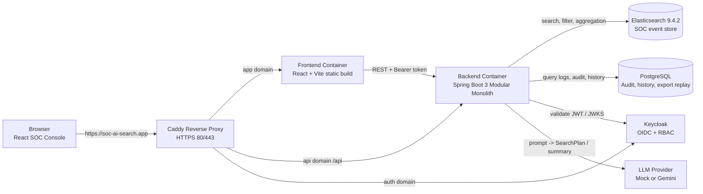

# 🛡️ SOC AI Search MVP

<details>
  <summary><b>📖 Table of Contents</b></summary>

  - [🚀 Live Demonstration](#live-demonstration)
  - [🏗️ Architectural Overview](#architectural-overview)
    - [🚧 Runtime Boundaries](#runtime-boundaries)
  - [🌟 Core MVP Features](#core-mvp-features)
  - [💻 Technology Stack](#technology-stack)
  - [📁 Repository Structure](#repository-structure)
  - [🛠️ Local Environment Prerequisites](#local-environment-prerequisites)
  - [⚡ Quick Start (Docker Compose)](#quick-start-docker-compose)
    - [🔗 Local Development Endpoints](#local-development-endpoints)
  - [🧪 Synthetic Dataset Seeding](#synthetic-dataset-seeding)
  - [🔑 Local Authentication via Keycloak](#local-authentication-via-keycloak)
    - [👤 User Onboarding Lifecycle](#user-onboarding-lifecycle)
    - [🛡️ RBAC Entitlement Matrix](#rbac-entitlement-matrix)
  - [⚙️ Critical Environment Configurations](#critical-environment-configurations)
  - [🤖 LLM Provider Configuration](#llm-provider-configuration)
  - [🌐 API Architecture Overview](#api-architecture-overview)
  - [🔍 SearchPlan Transparency and Auditability](#searchplan-transparency-and-auditability)
  - [📥 Secure CSV Export Pipeline](#secure-csv-export-pipeline)
  - [🔬 Testing and Verification Methodologies](#testing-and-verification-methodologies)
  - [🚀 Production Deployment Playbook](#production-deployment-playbook)
    - [🌐 DNS Configuration](#dns-configuration)
    - [💻 Virtual Private Server (VPS) Provisioning](#virtual-private-server-vps-provisioning)
    - [🔐 Production Environment Variables](#production-environment-variables)
  - [🔄 Continuous Integration & Continuous Deployment (CI/CD)](#continuous-integration-continuous-deployment-cicd)
  - [⏪ Infrastructure Rollback Procedures](#infrastructure-rollback-procedures)
  - [💾 Persistent Data Management](#persistent-data-management)
  - [🚑 Incident Troubleshooting Guide](#incident-troubleshooting-guide)
    - [❌ Frontend Unable to Establish Backend Connectivity](#frontend-unable-to-establish-backend-connectivity)
    - [❌ Keycloak Discarding Authentication with "Invalid Redirect URI"](#keycloak-discarding-authentication-with-invalid-redirect-uri)
    - [❌ Elasticsearch Container Fails to Bootstrap on Linux Nodes](#elasticsearch-container-fails-to-bootstrap-on-linux-nodes)
    - [❌ Gemini LLM Provider Returns HTTP 503/Unavailable](#gemini-llm-provider-returns-http-503unavailable)
    - [❌ Browser Refuses to Download CSV / Truncated Warning is Suppressed](#browser-refuses-to-download-csv-truncated-warning-is-suppressed)
  - [🛡️ Enterprise Security Posture](#enterprise-security-posture)
  - [🛣️ Strategic Roadmap / Out of Scope](#strategic-roadmap-out-of-scope)
</details>

**SOC AI Search** is an advanced enterprise platform designed to empower SOC (Security Operations Center) analysts to search, aggregate, and investigate security events using natural language. Rather than manually writing complex Elasticsearch Domain Specific Language (DSL), users can input queries in English or Vietnamese. The backend engine transcribes these natural language queries into a structured `SearchPlan`, enforces strict guardrails, compiles them into precise Elasticsearch Query DSL, and executes them against the event store. The system returns the results alongside the generated DSL to ensure complete transparency and auditability for security reviewers.

> **Architectural Principle:** Artificial Intelligence assists in the investigation process but is strictly prohibited from bypassing the backend validator or compiler. The Large Language Model (LLM) is restricted to generating a structured `SearchPlan`; the backend system retains ultimate authority over the execution of the final DSL.

## 🚀 Live Demonstration

The public demonstration environment is hosted via DigitalOcean Droplets, utilizing Name.com for DNS management and Caddy for HTTPS reverse proxying:

| Component | URL |
| --- | --- |
| Frontend Console | `https://soc-ai-search.app` |
| Backend Health Check | `https://api.soc-ai-search.app/api/v1/health/live` |
| Swagger / OpenAPI | `https://api.soc-ai-search.app/swagger-ui.html` |
| Keycloak Identity Provider | `https://auth.soc-ai-search.app` |

*Note: Demonstration credentials are provided securely to mentors and stakeholders and are intentionally excluded from this repository.*

## 🏗️ Architectural Overview



### 🚧 Runtime Boundaries

- 🚫 The frontend application does not interact directly with Elasticsearch, PostgreSQL, or the LLM. All requests are routed through the secure backend API.
- 🔒 The backend strictly isolates the LLM from generating arbitrary DSL for execution.
- 🗄️ PostgreSQL is utilized exclusively for application metadata, encompassing audit logs, query history, AI summaries, and query replay data.
- 🔍 Elasticsearch serves as the primary data store for SOC events and handles all search and aggregation workloads.
- 🌐 Caddy operates as the sole production reverse proxy at the edge. The current deployment strategy does not incorporate AWS, Nginx, Certbot, Jenkins, or ArgoCD.

## 🌟 Core MVP Features

- 🔍 **Natural Language Search:** Supports English and Vietnamese via the `POST /api/v1/search` endpoint.
- ⚙️ **Technical SearchPlan Endpoint:** `POST /api/v1/search/plan` enables direct testing of the core validator, compiler, and executor without involving the LLM.
- 🎛️ **Search Capabilities:** Comprehensive filtering by time range, severity, event type, user, host, IP, country code, and full-text `message_query`.
- 📊 **Aggregation Framework:** Supports analytical operations including `count`, `group_by`, `top_n`, and `date_histogram`.
- 👁️ **Query Transparency:** Responses include both the validated `search_plan` and the compiled `generated_dsl` as structured JSON objects.
- 🔬 **Event Detail Drilldown:** Retrieve raw logs via `GET /api/v1/events/{event_id}`, mapping directly to the Elasticsearch document `_id`.
- 🤖 **AI-Generated Summaries:** Best-effort textual summaries with robust fallbacks ensuring that LLM timeouts or failures do not compromise the search results.
- 📋 **Investigation Lifecycle Management:** Features recent investigation history, audit logging, query replays, and an `All Investigations` management view with pinning capabilities.
- 💡 **Contextual Next Steps:** Automated "Suggested next steps" dynamically generated based on search contexts to guide analyst investigations.
- 📈 **SOC Overview Dashboard:** Real-time metrics tracking Total Events, Failed Logins, Critical Alerts, Events Over Time, and Top Source IPs with a 10-minute auto-refresh cycle (operating independently of the LLM).
- 💾 **Secure CSV Export:** Exports bounded up to 10,000 records tied strictly to an authenticated `query_id` to prevent arbitrary DSL injection.
- 🔐 **Enterprise Identity & Access Management:** Comprehensive authentication lifecycle featuring self-registration, password recovery, and Keycloak-backed OpenID Connect (OIDC) with granular Role-Based Access Control (RBAC) supporting `SOC_VIEWER`, `SOC_ANALYST`, and `SOC_ADMIN` roles.
- 🖥️ **Optimized SOC UI:** Dark-mode console tailored for high-density information display, featuring Recharts integrations, raw event data tables, detailed inspection drawers, and history sheets.
- 🚢 **Automated CI/CD Pipelines:** GitHub Actions workflows governing backend verification, frontend linting and testing, Docker Compose configuration checks, and automated SSH-based VPS deployments.

## 💻 Technology Stack

| Category | Technologies |
| --- | --- |
| **🖥️ Frontend** |      |
| **⚙️ Backend & Core** |   |
| **💾 Data & Search** |   |
| **🛡️ DevOps, Security & AI** |      |

## 📁 Repository Structure

```text
backend/                         Spring Boot application backend
frontend/                        React + Vite SPA frontend
infra/elasticsearch/             Elasticsearch index mappings and settings
infra/keycloak/realm-export/     Keycloak realm configuration definitions
scripts/                         Bootstrap, synthetic data seeding, and smoke test utilities
docs/                            Architecture diagrams and engineering documentation
plan/                            Sprint implementation notes and prompt logs
.github/workflows/               Continuous Integration and Deployment pipelines
Caddyfile                        Production reverse proxy routing configurations
docker-compose.yml               Local development and base runtime services
docker-compose.deploy.yml        Production override configurations (Caddy integration)
```

## 🛠️ Local Environment Prerequisites

- 🐳 Docker Desktop or Docker Engine equipped with the Compose plugin.
- ☕ Java 21 (Required only if executing the backend outside of Docker).
- 🟢 Node.js 24 (Required only if executing the frontend outside of Docker).
- 🪟 Windows PowerShell (Required for executing infrastructure scripts on Windows environments).

## ⚡ Quick Start (Docker Compose)

```powershell
Copy-Item .env.example .env
Copy-Item frontend/.env.example frontend/.env
docker compose --profile auth up -d --build
.\scripts\bootstrap-elasticsearch.ps1
.\scripts\seed-events.ps1 -Count 10000
docker compose ps
```

### 🔗 Local Development Endpoints

| Service | Endpoint URL |
| --- | --- |
| Frontend Console | `http://localhost:3000` |
| Backend Health Probe | `http://localhost:8081/api/v1/health/live` |
| Swagger UI | `http://localhost:8081/swagger-ui.html` |
| Elasticsearch Node | `http://localhost:9200` |
| Keycloak Admin Console | `http://localhost:8082/admin` |
| PostgreSQL Access | `localhost:5433` (Accessible from host machine) |

*Optional: Kibana can be initialized for advanced local Elasticsearch debugging.*

```powershell
docker compose --profile tools up -d kibana
```

Access Kibana at `http://localhost:5601`. Note that Kibana is strictly a diagnostic tool and is not integrated into the public-facing UI.

## 🧪 Synthetic Dataset Seeding

The MVP ships with a synthetic dataset of SOC events indexed directly into the `soc-events-v1` Elasticsearch index.

```powershell
.\scripts\bootstrap-elasticsearch.ps1
.\scripts\seed-events.ps1 -Count 10000
```

**Operational Notes:**
- 📄 Raw events reside solely in Elasticsearch.
- 🗄️ PostgreSQL is utilized exclusively for metadata retention (audit trails, history logs, export replays).
- ⚠️ To generate larger datasets for stress-testing or extensive demonstrations, modify the `-Count` parameter. Ensure adequate RAM and disk capacity on the Elasticsearch node prior to execution.

## 🔑 Local Authentication via Keycloak

Initialize Keycloak by explicitly invoking the `auth` profile:

```powershell
docker compose --profile auth up -d keycloak
```

Navigate to `http://localhost:8082/admin`. Administrative credentials are fundamentally driven by configuration within the `.env` file; ensure production passwords are never committed to version control.

### 👤 User Onboarding Lifecycle

Users can initiate a self-registration flow or be explicitly provisioned by system administrators:

```text
User initiates Self-Registration on the Keycloak Auth portal
        ↓
User completes Email Verification process
        ↓
Admin audits account and elevates privileges to SOC_VIEWER / SOC_ANALYST / SOC_ADMIN as necessary
        ↓
User authenticates and accesses the SOC AI Search Console

Password Recovery Flow:
User selects "Forgot Password" -> Receives secure token via Email -> Resets Password.
```

To enable full self-service workflows, an SMTP provider must be configured within Keycloak. Detailed instructions are available in `infra/keycloak/README.md`. If SMTP remains unconfigured, administrators must manually provision temporary passwords via the Keycloak Credentials interface.

### 🛡️ RBAC Entitlement Matrix

| System Capability | SOC_VIEWER | SOC_ANALYST | SOC_ADMIN |
| --- | :---: | :---: | :---: |
| Authenticate & Access Dashboard | Yes | Yes | Yes |
| Execute Natural Language Queries | Yes | Yes | Yes |
| Inspect Deep Event Details | Yes | Yes | Yes |
| Access Investigation History | No | Yes | Yes |
| Export Data to CSV | No | Yes | Yes |
| Audit System Queries | No | No | Yes |
| Administer Keycloak Identities | No | No | Yes (Admin Console) |

Authorization is fundamentally enforced at the backend perimeter via Spring Security evaluating Keycloak JWT realm roles. The frontend strictly functions as a UX gating mechanism and relies on the backend as the definitive source of truth.

## ⚙️ Critical Environment Configurations

The root `.env` file governs backend functionality, infrastructure connectivity, and production domain mapping:

```env
APP_AUTH_ENABLED=true
APP_CORS_ALLOWED_ORIGIN_PATTERNS=http://localhost:*,http://127.0.0.1:*,https://soc-ai-search.app

APP_DOMAIN=soc-ai-search.app
API_DOMAIN=api.soc-ai-search.app
AUTH_DOMAIN=auth.soc-ai-search.app

ELASTICSEARCH_URL=http://localhost:9200
ELASTICSEARCH_INDEX_EVENTS=soc-events-v1

LLM_PROVIDER=mock
LLM_BASE_URL=
LLM_API_KEY=
LLM_MODEL=
LLM_TIMEOUT_MS=10000
LLM_SUMMARY_TIMEOUT_MS=5000
LLM_MAX_ATTEMPTS=2

KEYCLOAK_ISSUER_URI=http://localhost:8082/realms/soc-ai-search
KEYCLOAK_JWK_SET_URI=http://keycloak:8080/realms/soc-ai-search/protocol/openid-connect/certs

# SMTP Configuration for Account Lifecycle (Refer to infra/keycloak/README.md)
KEYCLOAK_SMTP_HOST=
KEYCLOAK_SMTP_PORT=587
KEYCLOAK_SMTP_FROM=no-reply@soc-ai-search.app
KEYCLOAK_SMTP_FROM_DISPLAY_NAME=SOC AI Search
KEYCLOAK_SMTP_USER=
KEYCLOAK_SMTP_PASSWORD=
KEYCLOAK_SMTP_AUTH=true
KEYCLOAK_SMTP_STARTTLS=true
KEYCLOAK_SMTP_SSL=false
```

The frontend `.env` file controls statically injected Vite build variables:

```env
VITE_USE_MOCK=false
VITE_API_BASE_URL=
VITE_AUTH_ENABLED=true
VITE_KEYCLOAK_AUTHORITY=http://localhost:8082/realms/soc-ai-search
VITE_KEYCLOAK_CLIENT_ID=soc-ai-search-frontend
VITE_KEYCLOAK_REDIRECT_URI=http://localhost:3000/auth/callback
VITE_KEYCLOAK_POST_LOGOUT_REDIRECT_URI=http://localhost:3000
VITE_KEYCLOAK_SCOPE=openid profile email
```

**Production Frontend Configuration Directive:**

```env
VITE_API_BASE_URL=https://api.soc-ai-search.app
VITE_KEYCLOAK_AUTHORITY=https://auth.soc-ai-search.app/realms/soc-ai-search
VITE_KEYCLOAK_REDIRECT_URI=https://soc-ai-search.app/auth/callback
VITE_KEYCLOAK_POST_LOGOUT_REDIRECT_URI=https://soc-ai-search.app
```

*Architectural Requirement: The frontend container must be rebuilt if any `VITE_*` environment variable undergoes modification.*

## 🤖 LLM Provider Configuration

- `LLM_PROVIDER=mock`: Recommended default for local development, automated testing, and CI pipelines. Operates entirely air-gapped without requiring network egress or external API keys.
- `LLM_PROVIDER=gemini`: Enterprise integration target for live demonstrations. Configuration mandates defining `LLM_BASE_URL`, `LLM_API_KEY`, and `LLM_MODEL` exclusively within the runtime `.env` file.

**Data Privacy Guardrails:**
The backend rigorously sanitizes all outbound traffic. Raw logs and comprehensive event documents are structurally prohibited from being transmitted to the LLM. Search planning relies solely on transmitting the natural language prompt coupled with a strict schema/allowlist. Summarization workflows transmit bounded, sanitized payloads. The summarization process is classified as a best-effort asynchronous task; if the LLM exceeds latency thresholds or responds erratically, the backend intercepts the failure, injects a deterministic fallback summary, and preserves the integrity of the primary search response.

## 🌐 API Architecture Overview

Swagger Documentation Portal:

```text
Local: http://localhost:8081/swagger-ui.html
Production: https://api.soc-ai-search.app/swagger-ui.html
```

Primary Contract Endpoints:

| HTTP Method | API Endpoint Route | Functional Purpose |
| --- | --- | --- |
| `GET` | `/api/v1/health/live` | Application Liveness Probe |
| `POST` | `/api/v1/events` | Single Event Ingestion |
| `POST` | `/api/v1/events/bulk` | Batch Event Ingestion (Max 1000/req) |
| `GET` | `/api/v1/events/{event_id}` | Event Detail Drilldown + Raw Log Extraction |
| `POST` | `/api/v1/search/plan` | Technical SearchPlan Submission (Bypasses LLM) |
| `POST` | `/api/v1/search` | Core Natural Language Search & Aggregation |
| `GET` | `/api/v1/search/history` | Authenticated Query History Retrieval |
| `GET` | `/api/v1/audit-logs` | Administrative Audit Log Inspection |
| `GET` | `/api/v1/search/{query_id}/export.csv` | Cryptographically Bounded CSV Export Replay |
| `GET` | `/api/v1/auth/me` | Contextual Authentication State & Role Verification |

Reference Natural Language Search Payload:

```json
{
  "question": "Show me failed login attempts from China in the last 24h",
  "page": 0,
  "size": 20
}
```

Reference Analytical Aggregation Payload:

```json
{
  "question": "Show the top 10 IP addresses with the most alerts this month",
  "page": 0,
  "size": 20
}
```

## 🔍 SearchPlan Transparency and Auditability

The architecture ensures zero obfuscation by exposing both the validated `search_plan` and the underlying compiled `generated_dsl` directly within the API response:

```json
{
  "query_id": "uuid",
  "original_question": "Find critical alerts over the past 7 days",
  "mode": "search",
  "search_plan": {
    "mode": "search",
    "filters": {
      "timestamp": { "from": "now-7d", "to": "now" },
      "severity": ["critical"]
    },
    "page": 0,
    "size": 20
  },
  "generated_dsl": {
    "query": {
      "bool": {
        "filter": [
          { "range": { "timestamp": { "gte": "now-7d", "lte": "now" } } },
          { "terms": { "severity": ["critical"] } }
        ]
      }
    },
    "sort": [{ "timestamp": { "order": "desc" } }]
  },
  "total": 123,
  "events": []
}
```

The `generated_dsl` is transmitted as a natively structured JSON object, preventing parsing anomalies and facilitating seamless UI rendering and security auditing.

## 📥 Secure CSV Export Pipeline

CSV extraction is architecturally coupled to an immutable `query_id` stored within the PostgreSQL database:

```text
GET /api/v1/search/{query_id}/export.csv
```

**Export Enforcement Protocols:**

- 🛡️ The backend extracts the historical SearchPlan snapshot corresponding to the requested `query_id`.
- 🛡️ The extracted SearchPlan is rigorously re-validated and synchronously re-compiled.
- 🛡️ A live playback query is dispatched to the Elasticsearch cluster.
- 🚫 The client is strictly prohibited from injecting ad-hoc or arbitrary DSL during the export lifecycle.
- 🛑 Output volume is hard-capped at 10,000 records, enforcing compliance with the default `index.max_result_window` inherent to Elasticsearch.
- ✂️ Text-heavy fields (e.g., `message`) are aggressively truncated to mitigate the risk of generating computationally exhaustive or excessively large CSV artifacts.
- 📄 HTTP Responses expose the `Content-Disposition` and `X-Export-Truncated` headers to guide frontend download state management securely.

## 🔬 Testing and Verification Methodologies

**Backend Verification:**

```powershell
cd backend
.\mvnw.cmd verify
cd ..
```

**Frontend Verification:**

```powershell
cd frontend
npm test -- --run
npm run lint
npm run build
cd ..
```

**Infrastructure Validation:**

```powershell
docker compose config --quiet
```

**Integration Smoke Testing:**

```powershell
.\scripts\smoke-test-day-08-auth.ps1
.\scripts\smoke-test-day-09-rbac.ps1
.\scripts\smoke-test-day-10-regression.ps1
.\scripts\smoke-test-day-11-domain.ps1
```

*Note: Automated Continuous Integration workflows force `LLM_PROVIDER=mock` to ensure execution determinism and protect commercial API quotas.*

## 🚀 Production Deployment Playbook

### 🌐 DNS Configuration

Configure the appropriate A records within the DNS registrar (e.g., Name.com):

```text
soc-ai-search.app      A  <VPS_PUBLIC_IP>
api.soc-ai-search.app  A  <VPS_PUBLIC_IP>
auth.soc-ai-search.app A  <VPS_PUBLIC_IP>
```

### 💻 Virtual Private Server (VPS) Provisioning

Perform foundational OS tuning on the target Ubuntu Droplet:

```bash
apt update
apt install -y git curl ca-certificates
sysctl -w vm.max_map_count=262144
echo "vm.max_map_count=262144" > /etc/sysctl.d/99-elasticsearch.conf
sysctl --system
```

Clone the repository and inject operational secrets into the `.env` files:

```bash
git clone https://github.com/<owner>/<repo>.git
cd soc-ai-search
cp .env.example .env
cp frontend/.env.example frontend/.env
nano .env
nano frontend/.env
```

Initialize the production deployment stack:

```bash
docker compose -f docker-compose.yml -f docker-compose.deploy.yml --profile auth --profile proxy up -d --build
docker compose -f docker-compose.yml -f docker-compose.deploy.yml --profile auth --profile proxy ps
```

*Security Mandate:* The host firewall must strictly restrict ingress to ports `22`, `80`, and `443`. Internal orchestration ports (`3000`, `8081`, `8082`, `9200`, `5433`, `5601`) must not be externally exposed.

### 🔐 Production Environment Variables

**Root `.env` Configuration:**

```env
APP_AUTH_ENABLED=true
APP_DOMAIN=soc-ai-search.app
API_DOMAIN=api.soc-ai-search.app
AUTH_DOMAIN=auth.soc-ai-search.app
KEYCLOAK_ISSUER_URI=https://auth.soc-ai-search.app/realms/soc-ai-search
KEYCLOAK_JWK_SET_URI=http://keycloak:8080/realms/soc-ai-search/protocol/openid-connect/certs
APP_CORS_ALLOWED_ORIGIN_PATTERNS=https://soc-ai-search.app
LLM_PROVIDER=gemini
LLM_API_KEY=<insert-highly-restricted-production-secret>
```

**Frontend `.env` Configuration:**

```env
VITE_USE_MOCK=false
VITE_API_BASE_URL=https://api.soc-ai-search.app
VITE_AUTH_ENABLED=true
VITE_KEYCLOAK_AUTHORITY=https://auth.soc-ai-search.app/realms/soc-ai-search
VITE_KEYCLOAK_REDIRECT_URI=https://soc-ai-search.app/auth/callback
VITE_KEYCLOAK_POST_LOGOUT_REDIRECT_URI=https://soc-ai-search.app
```

## 🔄 Continuous Integration & Continuous Deployment (CI/CD)

The CI pipeline (`.github/workflows/ci.yml`) is triggered on all pushes and Pull Requests:
- Executes Maven verification alongside JaCoCo static coverage gating.
- Invokes Frontend Vitest routines, ESLint static analysis, and triggers a production compilation test.
- Audits the structural integrity of the Docker Compose orchestration configuration.

The CD pipeline (`.github/workflows/deploy.yml`) is activated automatically following a successful CI run against the `main` branch, or via manual invocation:
1. Establishes a secure SSH tunnel to the target VPS utilizing GitHub Action Secrets.
2. Implements safeguards to preserve the runtime `.env` configurations and persisted volume data.
3. Synchronizes state (`git fetch`), purges orphaned artifacts, and enforces a hard reset against `origin/main`.
4. Executes a pre-flight validation of the Docker Compose configuration.
5. Issues a zero-downtime rebuild and restart command against the active Docker Compose production stack.
6. Executes a suite of external public domain smoke tests to verify endpoint availability.

**Required GitHub Action Secrets:**

```text
VPS_HOST
VPS_USER
VPS_PORT
VPS_APP_DIR
VPS_SSH_KEY
```

## ⏪ Infrastructure Rollback Procedures

To execute a localized rollback while preserving critical state within named Docker volumes:

```bash
cd /root/soc-ai-search
git fetch origin
git reflog --date=iso
git reset --hard <previous_stable_commit_sha>
docker compose -f docker-compose.yml -f docker-compose.deploy.yml --profile auth --profile proxy up -d --build
```

*Warning:* Execution of `docker compose down -v` will irrecoverably purge the PostgreSQL database, Elasticsearch indexes, Keycloak credential store, and Caddy cryptographic materials.

## 💾 Persistent Data Management

The architecture employs Named Docker Volumes to guarantee the survival of runtime data across application lifecycles:

- `postgres_data`: Houses audit logs, historical search state, and system metadata.
- `elasticsearch_data`: Retains indexed SOC security event documents.
- `keycloak_data`: Maintains active realms, user credential hashes, and active session tokens.
- `caddy_data`, `caddy_config`: Stores TLS/SSL certificates, cryptographic keys, and ACME challenge metadata.

The Keycloak realm configuration is dynamically imported exclusively upon initial cluster bootstrap. Subsequent configuration modifications should be executed via the Keycloak Administrative Console to avoid synchronization conflicts.

## 🚑 Incident Troubleshooting Guide

### ❌ Frontend Unable to Establish Backend Connectivity

Inspect the `frontend/.env` configuration residing on the VPS:

```bash
grep -nE 'VITE_API_BASE_URL|VITE_AUTH_ENABLED|VITE_KEYCLOAK_AUTHORITY' frontend/.env
```

Ensure `VITE_API_BASE_URL` strictly resolves to `https://api.soc-ai-search.app`. The frontend container must be forcefully rebuilt to apply configuration updates:

```bash
docker compose -f docker-compose.yml -f docker-compose.deploy.yml --profile auth --profile proxy up -d --build frontend
```

### ❌ Keycloak Discarding Authentication with "Invalid Redirect URI"

Access the Keycloak Admin Console, locate the `soc-ai-search-frontend` client configuration, and ensure adherence to these rules:

```text
Valid redirect URIs: https://soc-ai-search.app/auth/callback, https://soc-ai-search.app/*
Web origins: https://soc-ai-search.app
Valid post logout redirect URIs: https://soc-ai-search.app, https://soc-ai-search.app/*
```

### ❌ Elasticsearch Container Fails to Bootstrap on Linux Nodes

Verify that the underlying OS has allocated adequate virtual memory limits:

```bash
sysctl -w vm.max_map_count=262144
echo "vm.max_map_count=262144" > /etc/sysctl.d/99-elasticsearch.conf
sysctl --system
```

### ❌ Gemini LLM Provider Returns HTTP 503/Unavailable

Interrogate the live `.env` configuration while aggressively filtering out the actual API key string to prevent accidental log contamination:

```bash
grep -nE 'LLM_PROVIDER|LLM_BASE_URL|LLM_MODEL|LLM_TIMEOUT_MS' .env
```

Temporarily pivot the environment to `mock` to decisively isolate whether the fault lies with the external provider or internal routing:

```env
LLM_PROVIDER=mock
```

### ❌ Browser Refuses to Download CSV / Truncated Warning is Suppressed

For Cross-Origin Resource Sharing (CORS) deployments, the backend is strictly required to expose necessary response headers:

```text
Content-Disposition
X-Export-Truncated
```

The embedded Spring Security CORS configuration is engineered to handle this natively.

## 🛡️ Enterprise Security Posture

- 🚫 **Secret Management:** Hardcoded `.env` files, API keys, JWT signing keys, and demonstration credentials must never be committed to the repository.
- 🧱 **Firewall Policy:** Public edge exposure is severely restricted to ports `22` (Management), `80` (HTTP Challenge), and `443` (TLS traffic). All secondary infrastructure ports must remain isolated within the private Docker overlay network.
- 🔒 **Data Protection:** The LLM payload consists exclusively of bounded system schemas, controlled allowlists, and heavily sanitized summary payloads. Raw SOC logs are never transmitted beyond the internal boundaries.
- 🚷 **Zero-Trust Access:** The frontend serves purely as a UX enhancement layer. Authoritative Role-Based Access Control is enforced solely by the backend API.
- 💉 **Injection Prevention:** The CSV export mechanism is securely walled behind a replay-only architecture. The system fundamentally rejects client-supplied DSL injection attempts.

## 🛣️ Strategic Roadmap / Out of Scope

The current MVP focuses heavily on precision AI-driven search capabilities, statistical aggregation, automated summarization, non-repudiable audit logging, secure data extraction, and a hardened Keycloak RBAC foundation deployed over a public TLS framework.

Features categorized as out-of-scope for the MVP release timeline:

- ❌ Hardened multi-tenant data isolation logic.
- ❌ Native semantic or vector-based search integrations.
- ❌ Stateful, multi-turn LLM investigation chat interfaces.
- ❌ Machine Learning-driven advanced anomaly detection heuristics.
- ❌ Unrestricted front-end charting or dynamic dashboard generation modules.
- ❌ Enterprise-grade orchestration utilizing Kubernetes, Helm, or ArgoCD.
- ❌ High-throughput production SIEM ingestion pipelines spanning complex data lakes.