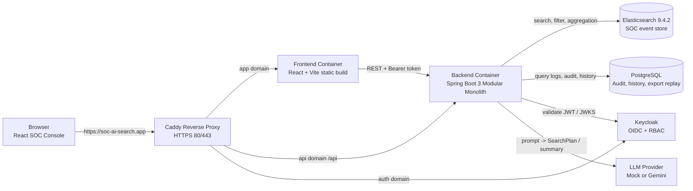

# SOC AI Search MVP

**SOC AI Search** là một nền tảng demo giúp SOC analyst tìm kiếm, thống kê và điều tra security event bằng ngôn ngữ tự nhiên. Thay vì viết Elasticsearch DSL thủ công, người dùng nhập câu hỏi tiếng Việt hoặc tiếng Anh; backend chuyển câu hỏi thành `SearchPlan`, validate bằng guardrail, compile thành Elasticsearch Query DSL và trả kết quả kèm DSL minh bạch để reviewer có thể kiểm tra.

> Trọng tâm đồ án: AI hỗ trợ điều tra nhưng không được bypass validator/compiler. LLM chỉ sinh `SearchPlan`; backend mới là nơi quyết định DSL thực thi.

## Link Demo

Bản demo public hiện dùng DigitalOcean Droplet, Name.com DNS và Caddy HTTPS:

| Thành phần | URL |
| --- | --- |
| Frontend | `https://soc-ai-search.app` |
| Backend health | `https://api.soc-ai-search.app/api/v1/health/live` |
| Swagger/OpenAPI | `https://api.soc-ai-search.app/swagger-ui.html` |
| Keycloak | `https://auth.soc-ai-search.app` |

Credential demo được gửi riêng cho mentor/hội đồng và không được lưu trong repository.

## Tổng Quan Kiến Trúc



### Ranh Giới Runtime

- Frontend không gọi trực tiếp Elasticsearch, PostgreSQL hoặc Gemini.
- Backend không cho LLM sinh DSL tự do để execute.
- PostgreSQL chỉ lưu application metadata: audit log, history, summary, query replay data.
- Elasticsearch là nơi lưu event SOC và chạy search/aggregation.
- Caddy là reverse proxy production duy nhất ở edge; không dùng AWS, Nginx, Certbot, Jenkins hoặc ArgoCD trong deployment hiện tại.

## Chức Năng MVP

- Natural language search tiếng Việt/Anh qua `POST /api/v1/search`.
- Technical SearchPlan endpoint `POST /api/v1/search/plan` để kiểm thử core validator/compiler/executor.
- Search mode: filter theo time range, severity, event type, user, host, IP, country code và full-text `message_query`.
- Aggregation mode: `count`, `group_by`, `top_n`, `date_histogram`.
- SearchPlan transparency: response trả `search_plan` và `generated_dsl` dạng JSON object, không phải string escaped.
- Event detail drawer qua `GET /api/v1/events/{event_id}`; `event_id` map từ Elasticsearch `_id`.
- AI summary best-effort/fallback: lỗi summary không làm search fail.
- Recent investigation history, audit log, query replay, và trang `All Investigations` với tính năng Pin/Unpin (Ghim câu hỏi nhanh qua icon sao).
- Thêm `Suggested next steps` (gợi ý điều tra tiếp theo) tự động theo ngữ cảnh sau mỗi kết quả search.
- Live `SOC Overview Dashboard` fetching Total Events, Failed Logins, Critical Alerts, Events Over Time, and Top Source IPs with 10m auto-refresh (no LLM calls).
- CSV export theo `query_id`, giới hạn 10.000 dòng, không nhận DSL từ client.
- Hệ thống Full Auth: Đăng nhập, Đăng ký (Self-registration), Quên mật khẩu (gửi Email), cùng Keycloak OIDC/RBAC với các role `SOC_VIEWER`, `SOC_ANALYST`, `SOC_ADMIN`.
- Frontend dark-mode SOC console tối ưu không gian hiển thị, biểu đồ Recharts, raw event table, detail drawer, history sheet.
- CI/CD GitHub Actions: backend verify, frontend test/lint/build, compose config và deploy VPS qua SSH.

## Tech Stack

| Lớp | Công nghệ |
| --- | --- |
| Frontend | React, TypeScript, Vite, Tailwind CSS, shadcn/ui, lucide-react, Recharts |
| Backend | Java 21, Spring Boot 3, Spring Security, Bean Validation, Springdoc OpenAPI |
| Search engine | Elasticsearch `9.4.2` Basic self-managed |
| Database | PostgreSQL 17 + Flyway |
| Auth/RBAC | Keycloak OIDC, realm roles `SOC_VIEWER`, `SOC_ANALYST`, `SOC_ADMIN` |
| LLM | Mock provider for dev/test/CI, Gemini provider for integration/demo |
| Packaging | Docker Compose |
| Reverse proxy | Caddy with automatic HTTPS |
| Hosting | DigitalOcean Droplet Ubuntu + Name.com DNS |
| CI/CD | GitHub Actions via SSH deploy |

## Cấu Trúc Repository

```text
backend/                         Spring Boot backend
frontend/                        React + Vite frontend
infra/elasticsearch/             Elasticsearch index mapping
infra/keycloak/realm-export/     Keycloak realm import
scripts/                         Bootstrap, seed and smoke test scripts
docs/                            Current architecture and project docs
plan/                            Day-by-day prompts and implementation notes
.github/workflows/               CI and CD workflows
Caddyfile                        Production reverse proxy routing
docker-compose.yml               Local/runtime services
docker-compose.deploy.yml        Production Caddy overrides
```

## Điều Kiện Chạy Local

- Docker Desktop or Docker Engine with Compose plugin.
- Java 21 if running backend outside Docker.
- Node.js 24 if running frontend outside Docker.
- Windows PowerShell for project scripts on Windows.

## Chạy Nhanh Local Bằng Docker Compose

```powershell
Copy-Item .env.example .env
Copy-Item frontend/.env.example frontend/.env
docker compose --profile auth up -d --build
.\scripts\bootstrap-elasticsearch.ps1
.\scripts\seed-events.ps1 -Count 10000
docker compose ps
```

Local URLs:

| Service | URL |
| --- | --- |
| Frontend | `http://localhost:3000` |
| Backend health | `http://localhost:8081/api/v1/health/live` |
| Swagger UI | `http://localhost:8081/swagger-ui.html` |
| Elasticsearch | `http://localhost:9200` |
| Keycloak Admin | `http://localhost:8082/admin` |
| PostgreSQL from host | `localhost:5433` |

Kibana is optional for local Elasticsearch debugging:

```powershell
docker compose --profile tools up -d kibana
```

Kibana opens at `http://localhost:5601`. It is not part of the public demo UI.

## Seed Dataset

The MVP dataset is synthetic SOC event data indexed into Elasticsearch index `soc-events-v1`.

```powershell
.\scripts\bootstrap-elasticsearch.ps1
.\scripts\seed-events.ps1 -Count 10000
```

Notes:

- Events live in Elasticsearch, not PostgreSQL.
- PostgreSQL stores audit/history/export replay metadata.
- For larger defense/demo datasets, increase `-Count` and watch Elasticsearch disk/RAM.

## Auth And Keycloak Local

Start Keycloak with the `auth` profile:

```powershell
docker compose --profile auth up -d keycloak
```

Open `http://localhost:8082/admin`. Admin credential is configured through `.env`; do not commit real passwords.

### User Onboarding Flow

Người dùng có thể tự đăng ký tài khoản (Self-registration) hoặc được Admin cấp tài khoản:

```text
Người dùng tự Đăng ký (Register) trên trang Auth
        ↓
Người dùng xác thực Email (Verify Email)
        ↓
Admin cấp quyền role phù hợp (SOC_VIEWER / SOC_ANALYST / SOC_ADMIN) nếu cần nâng quyền
        ↓
Người dùng đăng nhập vào SOC AI Search

Hoặc nếu quên mật khẩu:
Người dùng nhấn "Forgot Password" -> Nhận email -> Đặt lại mật khẩu mới.
```

For this flow to work, SMTP must be configured in Keycloak. See `infra/keycloak/README.md` for detailed SMTP setup. Without SMTP, admin can set a temporary password manually from the Credentials tab.

Demo credentials are sent separately and never stored in Git.

### RBAC Role Matrix

| Capability | SOC_VIEWER | SOC_ANALYST | SOC_ADMIN |
| --- | :---: | :---: | :---: |
| Login and view dashboard | Yes | Yes | Yes |
| Run natural language search | Yes | Yes | Yes |
| View event detail | Yes | Yes | Yes |
| View own/recent history | Không | Có | Có |
| Export CSV | Không | Có | Có |
| View audit logs | No | No | Yes |
| Manage Keycloak users | No | No | Admin Console only |

Backend enforces authorization with Spring Security and Keycloak JWT realm roles. Frontend hides locked UI actions but backend authorization remains the source of truth.

## Biến Môi Trường Quan Trọng

Root `.env` controls backend, infrastructure and production domains:

```env
APP_AUTH_ENABLED=true
APP_CORS_ALLOWED_ORIGIN_PATTERNS=http://localhost:*,http://127.0.0.1:*,https://soc-ai-search.app

APP_DOMAIN=soc-ai-search.app
API_DOMAIN=api.soc-ai-search.app
AUTH_DOMAIN=auth.soc-ai-search.app

ELASTICSEARCH_URL=http://localhost:9200
ELASTICSEARCH_INDEX_EVENTS=soc-events-v1

LLM_PROVIDER=mock
LLM_BASE_URL=
LLM_API_KEY=
LLM_MODEL=
LLM_TIMEOUT_MS=10000
LLM_SUMMARY_TIMEOUT_MS=5000
LLM_MAX_ATTEMPTS=2

KEYCLOAK_ISSUER_URI=http://localhost:8082/realms/soc-ai-search
KEYCLOAK_JWK_SET_URI=http://keycloak:8080/realms/soc-ai-search/protocol/openid-connect/certs

# Email onboarding SMTP (optional, see infra/keycloak/README.md)
KEYCLOAK_SMTP_HOST=
KEYCLOAK_SMTP_PORT=587
KEYCLOAK_SMTP_FROM=no-reply@soc-ai-search.app
KEYCLOAK_SMTP_FROM_DISPLAY_NAME=SOC AI Search
KEYCLOAK_SMTP_USER=
KEYCLOAK_SMTP_PASSWORD=
KEYCLOAK_SMTP_AUTH=true
KEYCLOAK_SMTP_STARTTLS=true
KEYCLOAK_SMTP_SSL=false
```

Frontend `.env` controls Vite build-time variables:

```env
VITE_USE_MOCK=false
VITE_API_BASE_URL=
VITE_AUTH_ENABLED=true
VITE_KEYCLOAK_AUTHORITY=http://localhost:8082/realms/soc-ai-search
VITE_KEYCLOAK_CLIENT_ID=soc-ai-search-frontend
VITE_KEYCLOAK_REDIRECT_URI=http://localhost:3000/auth/callback
VITE_KEYCLOAK_POST_LOGOUT_REDIRECT_URI=http://localhost:3000
VITE_KEYCLOAK_SCOPE=openid profile email
```

Production frontend should use:

```env
VITE_API_BASE_URL=https://api.soc-ai-search.app
VITE_KEYCLOAK_AUTHORITY=https://auth.soc-ai-search.app/realms/soc-ai-search
VITE_KEYCLOAK_REDIRECT_URI=https://soc-ai-search.app/auth/callback
VITE_KEYCLOAK_POST_LOGOUT_REDIRECT_URI=https://soc-ai-search.app
```

Whenever a `VITE_*` value changes, rebuild the frontend because Vite embeds these variables at build time.

## LLM Providers

- `LLM_PROVIDER=mock`: mặc định cho local development, automated tests và CI. Provider này không cần network hoặc API key.
- `LLM_PROVIDER=gemini`: chế độ integration/demo thật. Configure `LLM_BASE_URL`, `LLM_API_KEY` and `LLM_MODEL` in runtime `.env` only.

Backend không bao giờ gửi raw log/event document đầy đủ vào LLM. For search planning, it sends question plus schema/allowlist. For summary, it sends a compact sanitized payload and at most limited sample data. Summary là best-effort: if LLM times out or returns invalid text, the backend returns a deterministic fallback and keeps the search response successful.

## Tổng Quan API

Swagger UI:

```text
http://localhost:8081/swagger-ui.html
https://api.soc-ai-search.app/swagger-ui.html
```

Key endpoints:

| Method | Endpoint | Purpose |
| --- | --- | --- |
| `GET` | `/api/v1/health/live` | Liveness check |
| `POST` | `/api/v1/events` | Ingest one event |
| `POST` | `/api/v1/events/bulk` | Ingest events in bulk |
| `GET` | `/api/v1/events/{event_id}` | Event detail with raw log |
| `POST` | `/api/v1/search/plan` | Technical SearchPlan search/aggregation |
| `POST` | `/api/v1/search` | Natural language search/aggregation |
| `GET` | `/api/v1/search/history` | Query history |
| `GET` | `/api/v1/audit-logs` | Admin audit log view |
| `GET` | `/api/v1/search/{query_id}/export.csv` | CSV export replay |
| `GET` | `/api/v1/auth/me` | Current authenticated user and roles |

Example natural language request:

```json
{
  "question": "Show me failed login attempts from China in the last 24h",
  "page": 0,
  "size": 20
}
```

Example aggregation question:

```json
{
  "question": "Top 10 IP có nhiều alert nhất tháng này",
  "page": 0,
  "size": 20
}
```

## Minh Bạch SearchPlan Và DSL

The response contains both the validated `search_plan` and compiled `generated_dsl`:

```json
{
  "query_id": "uuid",
  "original_question": "Tìm alert critical trong 7 ngày qua",
  "mode": "search",
  "search_plan": {
    "mode": "search",
    "filters": {
      "timestamp": { "from": "now-7d", "to": "now" },
      "severity": ["critical"]
    },
    "page": 0,
    "size": 20
  },
  "generated_dsl": {
    "query": {
      "bool": {
        "filter": [
          { "range": { "timestamp": { "gte": "now-7d", "lte": "now" } } },
          { "terms": { "severity": ["critical"] } }
        ]
      }
    },
    "sort": [{ "timestamp": { "order": "desc" } }]
  },
  "total": 123,
  "events": []
}
```

`generated_dsl` is a JSON object/map, not an escaped JSON string. This is important for UI pretty rendering and for mentor review.

## CSV Export

CSV export is intentionally tied to a stored `query_id`:

```text
GET /api/v1/search/{query_id}/export.csv
```

Rules:

- Backend loads stored SearchPlan from PostgreSQL.
- Backend validates and compiles again.
- Backend replays the query live against Elasticsearch.
- Client cannot submit arbitrary DSL for export.
- Export is capped at 10.000 rows, aligned with Elasticsearch default `index.max_result_window`.
- `message` cell is truncated to a safe size to prevent huge CSV files.
- Response exposes `Content-Disposition` and `X-Export-Truncated` for frontend download UX.

## Test Và Verify

Backend:

```powershell
cd backend
.\mvnw.cmd verify
cd ..
```

Frontend:

```powershell
cd frontend
npm test -- --run
npm run lint
npm run build
cd ..
```

Docker Compose config:

```powershell
docker compose config --quiet
```

Smoke tests:

```powershell
.\scripts\smoke-test-day-08-auth.ps1
.\scripts\smoke-test-day-09-rbac.ps1
.\scripts\smoke-test-day-10-regression.ps1
.\scripts\smoke-test-day-11-domain.ps1
```

CI uses `LLM_PROVIDER=mock` so tests are deterministic and do not spend Gemini quota.

## Deploy Production

### DNS

Create A records at Name.com:

```text
soc-ai-search.app      A  <VPS_PUBLIC_IP>
api.soc-ai-search.app  A  <VPS_PUBLIC_IP>
auth.soc-ai-search.app A  <VPS_PUBLIC_IP>
```

### VPS Preparation

On DigitalOcean Ubuntu Droplet:

```bash
apt update
apt install -y git curl ca-certificates
sysctl -w vm.max_map_count=262144
echo "vm.max_map_count=262144" > /etc/sysctl.d/99-elasticsearch.conf
sysctl --system
```

Clone repository and create runtime env files:

```bash
git clone https://github.com/<owner>/<repo>.git
cd soc-ai-search
cp .env.example .env
cp frontend/.env.example frontend/.env
nano .env
nano frontend/.env
```

Run production stack:

```bash
docker compose -f docker-compose.yml -f docker-compose.deploy.yml --profile auth --profile proxy up -d --build
docker compose -f docker-compose.yml -f docker-compose.deploy.yml --profile auth --profile proxy ps
```

Only ports `22`, `80` and `443` should be public. Do not open public ports `3000`, `8081`, `8082`, `9200`, `5433` or `5601`.

### Production Env Highlights

Root `.env` production:

```env
APP_AUTH_ENABLED=true
APP_DOMAIN=soc-ai-search.app
API_DOMAIN=api.soc-ai-search.app
AUTH_DOMAIN=auth.soc-ai-search.app
KEYCLOAK_ISSUER_URI=https://auth.soc-ai-search.app/realms/soc-ai-search
KEYCLOAK_JWK_SET_URI=http://keycloak:8080/realms/soc-ai-search/protocol/openid-connect/certs
APP_CORS_ALLOWED_ORIGIN_PATTERNS=https://soc-ai-search.app
LLM_PROVIDER=gemini
LLM_API_KEY=<runtime-secret-only>
```

Frontend `.env` production:

```env
VITE_USE_MOCK=false
VITE_API_BASE_URL=https://api.soc-ai-search.app
VITE_AUTH_ENABLED=true
VITE_KEYCLOAK_AUTHORITY=https://auth.soc-ai-search.app/realms/soc-ai-search
VITE_KEYCLOAK_REDIRECT_URI=https://soc-ai-search.app/auth/callback
VITE_KEYCLOAK_POST_LOGOUT_REDIRECT_URI=https://soc-ai-search.app
```

## GitHub Actions CI/CD

CI (`.github/workflows/ci.yml`) runs on push and pull request:

- Backend Maven verify and JaCoCo coverage gate.
- Frontend Vitest, ESLint and production build.
- Docker Compose config validation.

CD (`.github/workflows/deploy.yml`) runs after successful CI on `main` or manually:

1. SSH into VPS with GitHub repository secrets.
2. Preserve runtime `.env`, `frontend/.env` and generated data.
3. `git fetch`, clean generated files and reset to `origin/main`.
4. Validate compose config.
5. Rebuild and restart Docker Compose production stack.
6. Run public domain smoke test.

Required GitHub secrets:

```text
VPS_HOST
VPS_USER
VPS_PORT
VPS_APP_DIR
VPS_SSH_KEY
```

## Rollback

Rollback without deleting Docker volumes:

```bash
cd /root/soc-ai-search
git fetch origin
git reflog --date=iso
git reset --hard <previous_commit_sha>
docker compose -f docker-compose.yml -f docker-compose.deploy.yml --profile auth --profile proxy up -d --build
```

Do not run `docker compose down -v` unless you intentionally want to delete PostgreSQL, Elasticsearch, Keycloak and Caddy persisted data.

## Dữ Liệu Lưu Bền Vững

Named volumes are used for runtime data:

- `postgres_data`: audit/history tables.
- `elasticsearch_data`: indexed SOC events.
- `keycloak_data`: realm/users/sessions runtime state.
- `caddy_data`, `caddy_config`: certificates and Caddy state.

Keycloak realm export is imported on first startup. If a Keycloak volume already exists, import does not overwrite existing realm/client settings; update through Admin Console or recreate volume intentionally.

## Troubleshooting

### Frontend cannot connect to backend in production

Check `frontend/.env` on VPS:

```bash
grep -nE 'VITE_API_BASE_URL|VITE_AUTH_ENABLED|VITE_KEYCLOAK_AUTHORITY' frontend/.env
```

`VITE_API_BASE_URL` should be `https://api.soc-ai-search.app`. Rebuild frontend after changing any `VITE_*` variable:

```bash
docker compose -f docker-compose.yml -f docker-compose.deploy.yml --profile auth --profile proxy up -d --build frontend
```

### Keycloak invalid redirect_uri

In Keycloak client `soc-ai-search-frontend`, verify:

```text
Valid redirect URIs: https://soc-ai-search.app/auth/callback, https://soc-ai-search.app/*
Web origins: https://soc-ai-search.app
Valid post logout redirect URIs: https://soc-ai-search.app, https://soc-ai-search.app/*
```

### Elasticsearch fails to start on Linux

Set `vm.max_map_count`:

```bash
sysctl -w vm.max_map_count=262144
echo "vm.max_map_count=262144" > /etc/sysctl.d/99-elasticsearch.conf
sysctl --system
```

### Gemini returns unavailable

Check runtime env only, without printing real key into logs:

```bash
grep -nE 'LLM_PROVIDER|LLM_BASE_URL|LLM_MODEL|LLM_TIMEOUT_MS' .env
```

Use mock to verify the rest of the system:

```env
LLM_PROVIDER=mock
```

### CSV filename or truncated warning missing

For cross-origin mode, backend must expose:

```text
Content-Disposition
X-Export-Truncated
```

The current Spring CORS config exposes these headers. Same-origin Caddy routing also avoids this issue.

## Ghi Chú Bảo Mật

- Never commit `.env`, API keys, tokens, private keys or demo passwords.
- Public production firewall should expose only `22`, `80`, `443`.
- Elasticsearch, PostgreSQL, backend app port, frontend container port and Keycloak internal port are not public.
- LLM receives schema/allowlist or sanitized summary payload only, not raw event logs.
- Backend enforces RBAC; frontend permission checks are UX only.
- CSV export replays stored validated SearchPlan; it does not accept client-supplied DSL.

## Roadmap / Ngoài Phạm Vi

Implemented MVP covers AI search, aggregation, summary, audit/history, CSV export, Keycloak RBAC, UI and public deployment.

Out of scope for current MVP:

- Multi-tenant isolation.
- Vector/semantic search.
- Multi-turn investigation chat.
- Advanced anomaly detection.
- Frontend chart dashboard builder.
- Kubernetes, ArgoCD hoặc Jenkins deployment.
- Production-grade SIEM ingestion pipeline.