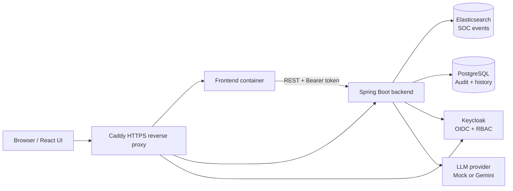

# SOC AI Search

SOC AI Search is a Security Operations Center investigation console that lets analysts search and aggregate security events with natural language while keeping the backend in control of execution.

The core idea is simple:

```text
Natural language question
    -> LLM generates SearchPlan
    -> Backend parses and validates SearchPlan
    -> Backend compiles Elasticsearch DSL
    -> Elasticsearch executes search/aggregation
    -> PostgreSQL stores audit/history
```

The LLM never executes Elasticsearch queries directly and never sends arbitrary DSL to the cluster. It only proposes a structured `SearchPlan`; the backend validator and compiler are the trusted execution boundary.

## Live Demo

| Component | URL |
| --- | --- |
| Frontend | `https://soc-ai-search.app` |
| Backend health | `https://api.soc-ai-search.app/api/v1/health/live` |
| Swagger UI | `https://api.soc-ai-search.app/swagger-ui.html` |
| Keycloak | `https://auth.soc-ai-search.app` |

Demo credentials are shared separately and must not be committed to the repository.

## Main Features

- Natural language search in English and Vietnamese.
- Safe `SearchPlan -> Validator -> DSL` pipeline.
- Search filters for time range, source, severity, event type, user, host, IP, country code, and message text.
- Multi-value filters for entity fields such as source, user, host, IP, severity, event type, and country code.
- Aggregations: `count`, `group_by`, `top_n`, and `date_histogram`.
- Query Transparency panel with:
  - Query Breakdown
  - Validated SearchPlan
  - Compiled DSL
- Editable SearchPlan for analysts/admins, with backend re-validation.
- Correct or Refine Query flow: user feedback is converted into a clearer natural language query and rerun through the safe pipeline.
- AI Summary with deterministic fallback when the LLM fails.
- AI Follow-up Suggestions for next investigation steps.
- Query Library page with curated SOC demo queries.
- Result filtering and sorting for returned event results.
- Event detail drawer with formatted fields and raw log view.
- SOC dashboard using fixed aggregation plans and 10-minute auto-refresh.
- Recent Queries and All Investigations with pin/unpin, server-side search/filter/pagination.
- Admin System Audit Logs with server-side search/filter/pagination and CSV export.
- Secure CSV export by `query_id`; the client never sends raw DSL for export.
- Keycloak authentication and RBAC for `SOC_VIEWER`, `SOC_ANALYST`, and `SOC_ADMIN`.
- GitHub Actions CI/CD and deployment to a DigitalOcean VPS behind Caddy HTTPS.

## Architecture



Runtime boundaries:

- Frontend never calls Elasticsearch, PostgreSQL, Keycloak admin APIs, or Gemini directly.
- Backend is the only service that compiles and executes DSL.
- PostgreSQL stores metadata only: audit logs, query history, pinned status, stored SearchPlan, generated DSL, summaries, and export replay data.
- Elasticsearch stores SOC event documents in `soc-events-v1`.
- Caddy is the public reverse proxy for production HTTPS.

## Technology Stack

| Area | Stack |
| --- | --- |
| Frontend | React, TypeScript, Vite, Tailwind CSS, shadcn/ui, lucide-react, Recharts, CodeMirror |
| Backend | Java 21, Spring Boot 3, Spring Security, Bean Validation, Jackson |
| Search | Elasticsearch 9.4.2 |
| Metadata | PostgreSQL, Flyway |
| Identity | Keycloak OIDC |
| AI | Mock LLM provider, Google Gemini provider |
| DevOps | Docker Compose, Caddy, GitHub Actions, DigitalOcean VPS |
| Tests | JUnit 5, MockMvc, Mockito, JaCoCo, Vitest, React Testing Library |

## Repository Structure

```text
backend/                         Spring Boot backend
frontend/                        React + Vite frontend
infra/elasticsearch/             Elasticsearch index mapping
infra/keycloak/realm-export/     Keycloak realm export
scripts/                         Bootstrap, seed, and smoke-test scripts
docs/                            Architecture and project documentation
docs/plan/                       Implementation plans and prompts
.github/workflows/               CI/CD workflows
Caddyfile                        Production reverse proxy config
docker-compose.yml               Base local/runtime services
docker-compose.deploy.yml        Production compose override
```

## Quick Start

```powershell
Copy-Item .env.example .env
Copy-Item frontend/.env.example frontend/.env
docker compose --profile auth up -d --build
.\scripts\bootstrap-elasticsearch.ps1
.\scripts\seed-events.ps1 -Count 10000
docker compose ps
```

Local endpoints:

| Service | URL |
| --- | --- |
| Frontend | `http://localhost:3000` |
| Backend health | `http://localhost:8081/api/v1/health/live` |
| Swagger UI | `http://localhost:8081/swagger-ui.html` |
| Elasticsearch | `http://localhost:9200` |
| Keycloak admin | `http://localhost:8082/admin` |
| PostgreSQL | `localhost:5433` |
| Kibana, optional | `http://localhost:5601` |

Optional Kibana:

```powershell
docker compose --profile tools up -d kibana
```

## Seed Data

The demo dataset is generated by PowerShell scripts and indexed into Elasticsearch with the Bulk API.

```powershell
.\scripts\bootstrap-elasticsearch.ps1
.\scripts\seed-events.ps1 -Count 10000
```

On the VPS:

```bash
pwsh ./scripts/bootstrap-elasticsearch.ps1
pwsh ./scripts/seed-events.ps1 -Count 10000
```

The synthetic schema includes:

- `timestamp`
- `source`
- `severity`
- `event_type`
- `user`
- `host`
- `ip`
- `country_code`
- `message`
- `raw`

## Authentication and Roles

The app uses Keycloak realm `soc-ai-search` and frontend client `soc-ai-search-frontend`.

| Capability | SOC_VIEWER | SOC_ANALYST | SOC_ADMIN |
| --- | :---: | :---: | :---: |
| Search | Yes | Yes | Yes |
| Event detail | Yes | Yes | Yes |
| Dashboard | Yes | Yes | Yes |
| Edit SearchPlan | No | Yes | Yes |
| Pin investigations | No | Yes | Yes |
| Export result CSV | No | Yes | Yes |
| All Investigations | No | Yes | Yes |
| System Audit Logs | No | No | Yes |
| Keycloak admin link | No | No | Yes |

The frontend hides unavailable actions for UX, but the backend enforces authorization with Spring Security and Keycloak JWT roles.

## LLM Configuration

Use `LLM_PROVIDER=mock` for deterministic local development and CI.

Use `LLM_PROVIDER=gemini` for Google Gemini integration:

```env
LLM_PROVIDER=gemini
LLM_BASE_URL=<gemini-api-base-url>
LLM_API_KEY=<secret>
LLM_MODEL=<model-name>
LLM_TIMEOUT_MS=10000
LLM_SUMMARY_TIMEOUT_MS=5000
LLM_MAX_ATTEMPTS=2
```

Use `LLM_PROVIDER=anthropic` for Anthropic Claude integration:

```env
LLM_PROVIDER=anthropic
LLM_BASE_URL=https://api.anthropic.com
LLM_API_KEY=<anthropic-api-key>
LLM_MODEL=<anthropic-model-id>
LLM_TIMEOUT_MS=10000
LLM_SUMMARY_TIMEOUT_MS=5000
LLM_MAX_ATTEMPTS=2
```

AI-related flows:

- Natural language query to SearchPlan.
- Best-effort result summary.
- Correct or Refine Query.
- AI Follow-up Suggestions.

LLM failures are controlled. Search can still return results with fallback summary behavior when summary generation fails.

## API Overview

| Method | Endpoint | Purpose |
| --- | --- | --- |
| `GET` | `/api/v1/health/live` | Health check |
| `POST` | `/api/v1/events` | Single event ingestion |
| `POST` | `/api/v1/events/bulk` | Bulk event ingestion |
| `GET` | `/api/v1/events/{event_id}` | Event detail |
| `POST` | `/api/v1/search` | Natural language search/aggregation |
| `POST` | `/api/v1/search/plan` | Execute an explicit SearchPlan |
| `POST` | `/api/v1/search/refine` | Correct/refine a query with AI |
| `POST` | `/api/v1/suggestions/follow-up` | AI follow-up suggestions |
| `GET` | `/api/v1/search/history` | Query history |
| `GET` | `/api/v1/search/history/{query_id}` | Query detail |
| `PATCH` | `/api/v1/search/history/{query_id}/pin` | Pin/unpin investigation |
| `GET` | `/api/v1/audit-logs` | Admin audit logs |
| `GET` | `/api/v1/audit-logs/export.csv` | Admin audit CSV export |
| `GET` | `/api/v1/search/{query_id}/export.csv` | Result CSV export |
| `GET` | `/api/v1/auth/me` | Current user and roles |

## Secure CSV Export

Result export uses stored `query_id`:

```text
GET /api/v1/search/{query_id}/export.csv
```

The backend:

1. Loads the stored SearchPlan from PostgreSQL.
2. Checks the current user's access.
3. Validates the SearchPlan again.
4. Compiles DSL again.
5. Replays the query against Elasticsearch.
6. Streams CSV with a maximum of 10,000 rows.

This prevents clients from sending arbitrary DSL during export.

## Testing

Backend:

```powershell
cd backend
.\mvnw.cmd verify
cd ..
```

Frontend:

```powershell
cd frontend
npm run lint
npm run test
npm run build
cd ..
```

Compose config:

```powershell
docker compose config --quiet
```

Smoke tests:

```powershell
.\scripts\smoke-test-day-09-rbac.ps1
.\scripts\smoke-test-day-10-regression.ps1
.\scripts\smoke-test-day-11-domain.ps1
```

## Production Deployment

DNS records:

```text
soc-ai-search.app      A  <VPS_PUBLIC_IP>
api.soc-ai-search.app  A  <VPS_PUBLIC_IP>
auth.soc-ai-search.app A  <VPS_PUBLIC_IP>
```

Deploy on VPS:

```bash
git clone https://github.com/<owner>/<repo>.git
cd soc-ai-search
cp .env.example .env
cp frontend/.env.example frontend/.env
nano .env
nano frontend/.env
docker compose -f docker-compose.yml -f docker-compose.deploy.yml --profile auth --profile proxy up -d --build
```

Only ports `22`, `80`, and `443` should be publicly reachable.

## Documentation

- [Architecture](docs/architecture.md)
- [Sequence flows](docs/sequence-flow.md)
- [Technology stack](docs/tech-stack.md)
- [Requirements](docs/requirement.md)
- [Authentication onboarding](docs/auth-onboarding.md)
- [Demo script](docs/demo-script.md)
- [Search engine decision](docs/search-engine-decision.md)
