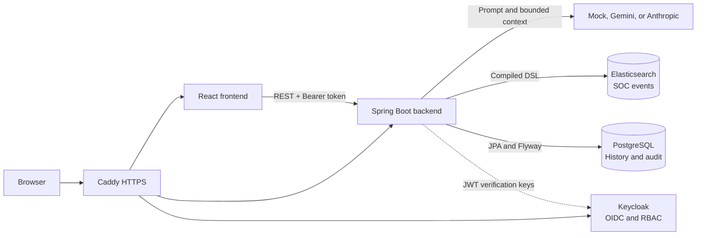

<div align="center">

# 🛡️ SOC AI Search

Natural-language security event investigation with a backend-controlled SearchPlan safety boundary.

</div>

## <a id="table-of-contents"></a>📚 Table of Contents

- [Overview](#overview)
- [Key Capabilities](#key-capabilities)
- [Architecture](#architecture)
- [Technology Stack](#technology-stack)
- [Repository Structure](#repository-structure)
- [Quick Start](#quick-start)
- [Verification](#verification)
- [Deployed Services](#deployed-services)
- [Documentation](#documentation)

## <a id="overview"></a>🔎 Overview

SOC AI Search is a Security Operations Center console for searching and aggregating security events in English or Vietnamese. Its core design keeps the LLM outside the trusted execution boundary: the model proposes a structured `SearchPlan`, while the backend parses, validates, compiles, and executes the final Elasticsearch DSL.

This design supports an explainable investigation workflow without allowing the browser or an LLM to submit arbitrary Elasticsearch queries.

## <a id="key-capabilities"></a>✨ Key Capabilities

- **Search and analytics:** natural-language search, structured filters, count, group-by, top-N, and time-series aggregations.
- **AI-assisted investigation:** query refinement, bounded result summaries, and follow-up investigation suggestions with controlled fallback behavior.
- **Transparency and review:** Query Breakdown, validated SearchPlan, compiled DSL, editable plans, and centered event-detail views.
- **SOC workflows:** three-minute dashboard refresh, query library, personal investigations, system audit logs, and replay-based CSV export.
- **Platform controls:** Keycloak OIDC, backend-enforced RBAC, request correlation, automated tests, CI/CD, and HTTPS deployment through Caddy.

## <a id="architecture"></a>🏗️ Architecture



The frontend never accesses Elasticsearch or PostgreSQL directly. The backend is the only component that validates SearchPlan and compiles executable DSL; LLM output is always treated as untrusted input.

## <a id="technology-stack"></a>🧰 Technology Stack

| Layer | Technology |
| --- | --- |
| Frontend | React 19, TypeScript 6, Vite 8, Tailwind CSS 4, Radix UI, Recharts |
| Backend | Java 21, Spring Boot 3.5, Spring Security, Spring Data JPA |
| Data | Elasticsearch 9.4, PostgreSQL 17, Flyway |
| Identity | Keycloak 26.6, OpenID Connect, JWT |
| AI | Mock provider, Google Gemini, Anthropic Claude |
| Operations | Docker Compose, Caddy, GitHub Actions, DigitalOcean VPS |
| Testing | JUnit, MockMvc, Mockito, JaCoCo, Vitest, React Testing Library |

## <a id="repository-structure"></a>🗂️ Repository Structure

```text
.
|-- backend/              Spring Boot modular monolith
|-- frontend/             React feature-based application
|-- infra/                Elasticsearch mapping and Keycloak assets
|-- scripts/              Bootstrap, seed, and smoke-test scripts
|-- docs/                 Architecture, operations, and project documentation
|-- .github/workflows/    CI and VPS deployment workflows
|-- docker-compose.yml    Core services and optional auth/tools profiles
|-- docker-compose.deploy.yml
`-- Caddyfile             Production HTTPS routing
```

## <a id="quick-start"></a>🚀 Quick Start

Prerequisites: Docker with Compose and PowerShell.

```powershell
Copy-Item .env.example .env
Copy-Item frontend/.env.example frontend/.env
docker compose up -d --build
./scripts/bootstrap-elasticsearch.ps1
./scripts/seed-events.ps1 -Count 10000
docker compose ps
```

The default configuration uses the deterministic mock LLM and keeps authentication disabled. To include local Keycloak, configure the auth variables in both environment files and start the `auth` profile:

```powershell
docker compose --profile auth up -d --build
```

| Service | Local URL |
| --- | --- |
| Frontend | <http://localhost:3000> |
| Backend health | <http://localhost:8081/api/v1/health/live> |
| Swagger UI | <http://localhost:8081/swagger-ui/index.html> |
| Keycloak, `auth` profile | <http://localhost:8082> |
| Kibana, `tools` profile | <http://localhost:5601> |

## <a id="verification"></a>✅ Verification

```powershell
cd backend
./mvnw.cmd verify
cd ../frontend
npm ci
npm test
npm run lint
npm run build
cd ..
docker compose config --quiet
```

These checks are also represented in [the CI workflow](.github/workflows/ci.yml). Successful CI on `main` can trigger the VPS deployment and public smoke test defined in [the CD workflow](.github/workflows/deploy.yml).

## <a id="deployed-services"></a>🌐 Deployed Services

| Component | URL |
| --- | --- |
| Web application | <https://soc-ai-search.app> |
| Backend health | <https://api.soc-ai-search.app/api/v1/health/live> |
| Swagger UI | <https://api.soc-ai-search.app/swagger-ui/index.html> |
| Identity provider | <https://auth.soc-ai-search.app> |

Credentials and secrets are managed outside the repository.

## <a id="documentation"></a>📖 Documentation

- [Frontend guide](frontend/README.md)
- [Backend guide](backend/README.md)
- [System architecture](docs/architecture.md)
- [Sequence flows](docs/sequence-flow.md)
- [Technology decisions](docs/tech-stack.md)
- [Search engine decision](docs/search-engine-decision.md)
- [Operations guide](docs/operations.md)
- [Security model](docs/security.md)
- [Authentication onboarding](docs/auth-onboarding.md)
