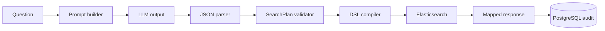

<div align="center">

# ⚙️ SOC AI Search Backend

Spring Boot modular monolith that owns query safety, authorization, execution, and auditability.


</div>

## <a id="table-of-contents"></a>📚 Table of Contents

- [Architecture](#architecture)
- [Module Map](#module-map)
- [Natural-Language Search Flow](#natural-language-search-flow)
- [Security and Guardrails](#security-and-guardrails)
- [Observability](#observability)
- [Configuration](#configuration)
- [Quick Start](#quick-start)
- [OpenAPI](#openapi)
- [Verification](#verification)
- [Related Documentation](#related-documentation)

## <a id="architecture"></a>🏗️ Architecture

The backend treats LLM output and client input as untrusted. Business modules are organized as a modular monolith and generally follow four layers:

```text
api/             REST controllers and transport DTOs
application/     Use-case orchestration
domain/          Contracts, policies, validation, and business rules
infrastructure/  Elasticsearch, JPA, CSV, and external HTTP adapters
```

The package layout makes ownership explicit: API code handles transport, application services orchestrate use cases, domain packages hold core contracts and policies, and infrastructure packages integrate databases and external providers.

## <a id="module-map"></a>🧩 Module Map

| Module | Responsibility |
| --- | --- |
| `search` | SearchPlan contract, natural-language orchestration, parsing, validation, compilation, and Elasticsearch execution. |
| `search/refinement` | AI-assisted correction and refinement of the current query. |
| `summary` | Bounded summary payloads, language selection, LLM summaries, validation, and deterministic fallback. |
| `suggestions` | AI-generated follow-up investigation questions. |
| `audit` | Query history, personal investigations, pinning, system audit logs, and audit export. |
| `event` | Single/bulk event ingestion and event detail lookup. |
| `export` | Search-result CSV replay from a stored `query_id`. |
| `llm` | Provider-neutral port with mock, Gemini, and Anthropic adapters. |
| `security` | JWT authority mapping, current-user context, role hierarchy, and RBAC helpers. |
| `config` | Typed Elasticsearch, LLM, and OpenAPI configuration. |
| `common` | Shared error handling and request-correlation logging. |

## <a id="natural-language-search-flow"></a>🔁 Natural-Language Search Flow



1. The LLM is instructed to return one SearchPlan JSON object.
2. `SearchPlanJsonParser` rejects malformed JSON, prose, markdown, and unknown fields.
3. `SearchPlanValidator` enforces modes, time bounds, value limits, field allowlists, and aggregation rules.
4. `SearchPlanCompiler` creates the executable Elasticsearch DSL.
5. The executor maps search hits or aggregation buckets into stable API responses.
6. Audit persistence records the controlled plan, generated DSL, outcome, and user context.

The LLM never sends DSL to Elasticsearch directly.

## <a id="security-and-guardrails"></a>🛡️ Security and Guardrails

- Keycloak issues JWT access tokens; Spring Security verifies signatures and maps realm/client roles.
- The role hierarchy is `SOC_ADMIN > SOC_ANALYST > SOC_VIEWER`; method security enforces access at the API boundary.
- SearchPlan supports bounded page sizes, entity counts, time ranges, aggregation sizes, and allowlisted sort/aggregation fields.
- Unknown JSON fields are rejected globally by Jackson and again where SearchPlan parsing needs stricter handling.
- Search export accepts `query_id`, not client-supplied DSL. It reloads the stored plan, checks scope, validates and compiles again, then streams current Elasticsearch results.
- Search and audit exports are capped at 10,000 rows, expose `X-Export-Truncated`, and neutralize spreadsheet formula prefixes.

## <a id="observability"></a>📡 Observability

`CorrelationIdFilter` accepts or generates `X-Request-Id`, returns it to the caller, and stores it in MDC. `RequestLoggingFilter` records request ID, query ID when available, user identity, roles, method, path, status, and latency without logging tokens, request bodies, or raw security events.

## <a id="configuration"></a>⚙️ Configuration

Copy [the root environment template](../.env.example) and configure only the providers required by the target environment.

| Group | Main environment variables |
| --- | --- |
| PostgreSQL | `POSTGRES_HOST`, `POSTGRES_PORT`, `POSTGRES_DB`, `POSTGRES_USER`, `POSTGRES_PASSWORD` |
| Elasticsearch | `ELASTICSEARCH_URL`, `ELASTICSEARCH_INDEX_EVENTS`, optional credentials |
| Authentication | `APP_AUTH_ENABLED`, `KEYCLOAK_ISSUER_URI`, `KEYCLOAK_JWK_SET_URI` |
| LLM | `LLM_PROVIDER`, `LLM_BASE_URL`, `LLM_API_KEY`, `LLM_MODEL`, timeout/retry settings |
| HTTP and export | `APP_CORS_ALLOWED_ORIGIN_PATTERNS`, `EXPORT_ES_TIMEOUT_MS` |

Do not commit populated `.env` files or provider credentials.

## <a id="quick-start"></a>🚀 Quick Start

From the repository root, start the backend and its required data services:

```powershell
Copy-Item .env.example .env
docker compose up -d --build backend
```

The backend is available through the host at `http://localhost:8081`; the container itself listens on port `8080`.

## <a id="openapi"></a>🧾 OpenAPI

Swagger UI: <http://localhost:8081/swagger-ui/index.html>

| API group | Core endpoints |
| --- | --- |
| Natural-language search | `POST /api/v1/search` |
| Explicit SearchPlan | `POST /api/v1/search/plan` |
| AI assistance | `POST /api/v1/search/refine`, `POST /api/v1/suggestions/follow-up` |
| Investigations and audit | `GET /api/v1/search/history`, `GET /api/v1/audit-logs` |
| Export | `GET /api/v1/search/{queryId}/export.csv`, `GET /api/v1/audit-logs/export` |
| Events and health | `/api/v1/events`, `GET /api/v1/health/live` |

OpenAPI descriptions and security metadata are generated by Springdoc from controller annotations and `OpenApiConfig`.

## <a id="verification"></a>✅ Verification

Windows:

```powershell
./mvnw.cmd verify
```

Linux or macOS:

```bash
chmod +x ./mvnw
./mvnw verify
```

`verify` runs the backend tests and the configured JaCoCo instruction-coverage gate. The HTML report is generated at:

```text
target/site/jacoco/index.html
```

## <a id="related-documentation"></a>📖 Related Documentation

- [Project overview](../README.md)
- [Frontend architecture](../frontend/README.md)
- [System architecture](../docs/architecture.md)
- [Swagger testing guide](../docs/questions/mini_questions/swagger_api_testing_guide.md)
- [SearchPlan parse, validate, and compile](../docs/questions/mini_questions/searchplan_parse_validate_compile.md)
