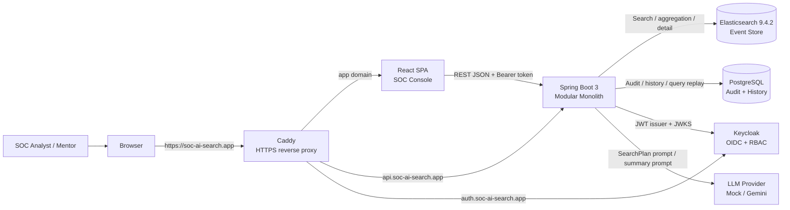
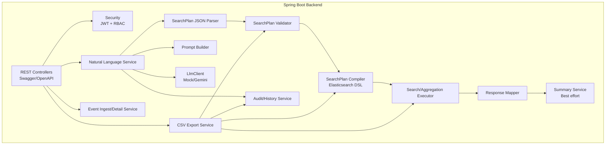
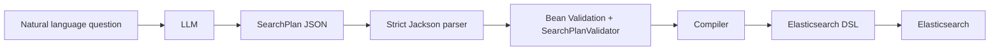
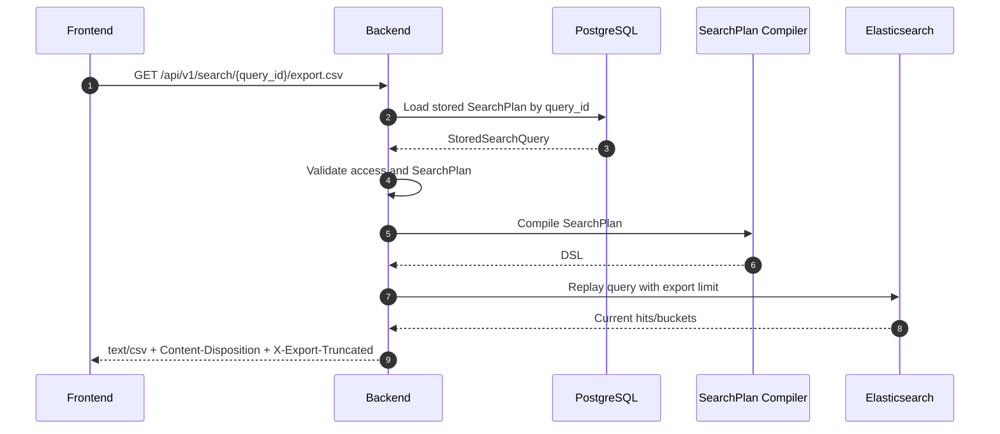
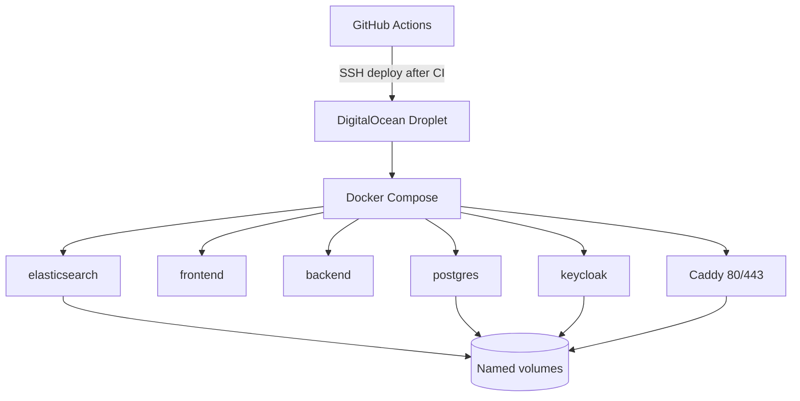

# Kiến Trúc Hệ Thống - SOC AI Search MVP

## 1. Mục đích

Tài liệu này mô tả kiến trúc hiện tại của SOC AI Search MVP sau Day 11. Hệ thống đã có frontend thật, backend API, Elasticsearch, PostgreSQL, Keycloak/RBAC, CSV export, summary, CI/CD và deploy public bằng DigitalOcean + Name.com + Caddy.

## 2. Kiến trúc tổng thể

Hệ thống là **modular monolith**:

- Một backend Spring Boot 3 duy nhất chứa các module nghiệp vụ.
- Frontend React là SPA riêng.
- Elasticsearch, PostgreSQL, Keycloak, Caddy và LLM là dependency/runtime service.
- Không chia backend thành microservice trong MVP.

## 3. Domain routing

| Domain | Route | Target |
| --- | --- | --- |
| `https://soc-ai-search.app` | UI | Frontend container |
| `https://api.soc-ai-search.app` | REST API + Swagger | Backend container |
| `https://auth.soc-ai-search.app` | OIDC and Admin Console | Keycloak container |

Caddy owns public ports `80` and `443`. Internal service ports are not exposed publicly.

## 4. Backend module architecture

Key rule: LLM output must pass parser and validator before compiler produces DSL.

## 5. Data stores

### 5.1. Elasticsearch

Elasticsearch stores SOC event documents in index `soc-events-v1`.

Main responsibilities:

- Full-text `match` on `message`.
- Exact filters on keyword/IP fields.
- Range query on `timestamp`.
- `terms` aggregation for group/top.
- `date_histogram` aggregation for time-series.
- Event detail by Elasticsearch document `_id`.

### 5.2. PostgreSQL

PostgreSQL stores application metadata, not event documents.

Main table:

- `search_query_logs`

Responsibilities:

- Query history.
- Audit log.
- Status and failure stage.
- Validated SearchPlan snapshot.
- Generated DSL snapshot, capped for safety.
- Result count, latency and summary.
- Source data for CSV export replay by `query_id`.

### 5.3. Keycloak

Keycloak owns user login and realm roles:

- `SOC_VIEWER`
- `SOC_ANALYST`
- `SOC_ADMIN`

Backend maps roles from `realm_access.roles` and applies Spring role hierarchy. Frontend reads role for UI gating, but backend authorization remains authoritative.

## 6. SearchPlan security model

Guardrails:

- Reject unknown JSON fields.
- Reject unsupported mode/aggregation type.
- Reject unsupported filter/aggregation fields.
- Reject `.keyword`, scripts, wildcard and query string generated by LLM.
- Enforce `size <= 100`.
- Backend overrides pagination from request.

## 7. Summary architecture

Summary is optional best-effort:

- Search mode may run one bounded summary query.
- Aggregation mode uses existing `aggregation_results` directly.
- Payload is compact and sanitized.
- LLM failure returns fallback summary and does not fail the search.

## 8. CSV export architecture

CSV export uses query replay:

The client cannot submit arbitrary DSL for export.

## 9. Deployment architecture

Production hardening:

- Public firewall only `22`, `80`, `443`.
- Elasticsearch/PostgreSQL/Keycloak/internal app ports are not public.
- Secrets stay in VPS `.env` or GitHub Actions secrets.
- Do not run `docker compose down -v` unless intentionally deleting data.