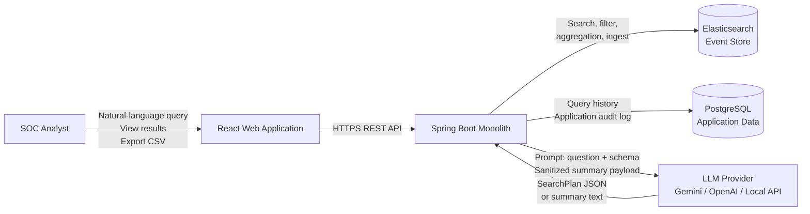
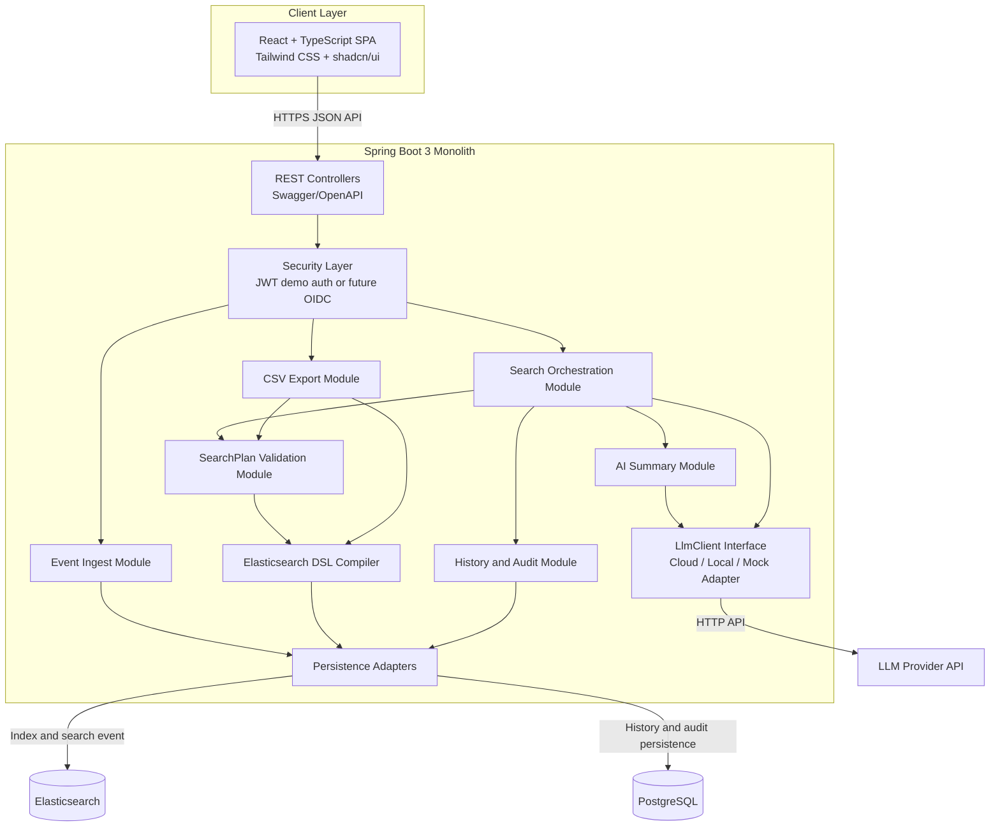
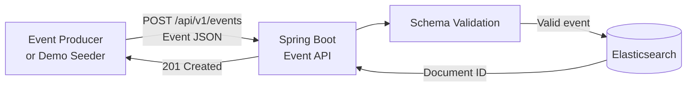
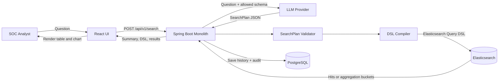
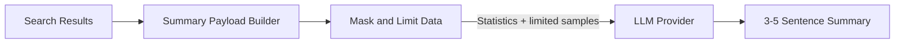
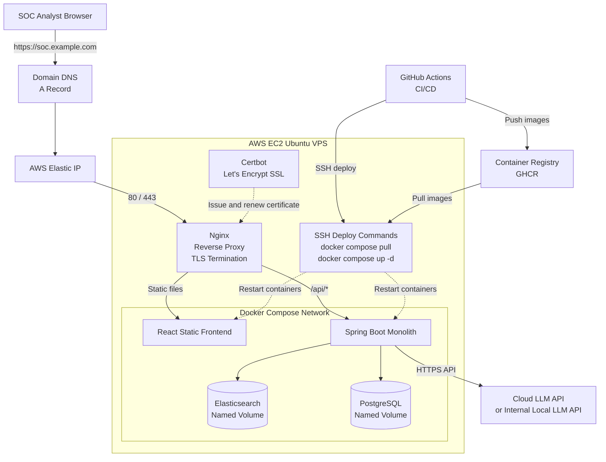
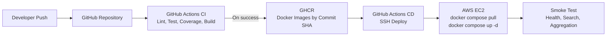

# System Architecture - SOC AI Event Search

## 1. Document Overview

### 1.1. Purpose

Tài liệu này mô tả kiến trúc tổng thể cho đồ án:

> **Xây dựng tính năng Tìm kiếm Event bằng AI cho SOC Platform**

Hệ thống hỗ trợ SOC analyst tìm kiếm, thống kê và điều tra event bằng câu hỏi tự nhiên tiếng Việt hoặc tiếng Anh. Backend dùng LLM để chuyển câu hỏi thành kế hoạch truy vấn có cấu trúc, validate kế hoạch đó, compile thành Elasticsearch Query DSL và thực thi trên kho event.

### 1.2. Architecture Decision

Hệ thống được xây dựng theo **Modular Monolithic Architecture**.

- Toàn bộ business logic thuộc một Spring Boot application.
- Spring Boot backend được build và deploy như một đơn vị duy nhất.
- Các module nội bộ phân tách theo trách nhiệm nhưng không giao tiếp qua network.
- Elasticsearch và PostgreSQL là data store.
- LLM Provider là external dependency hoặc local inference dependency.
- Nginx là reverse proxy tại biên hệ thống.

Elasticsearch, PostgreSQL, Nginx và LLM không phải các microservice do hệ thống tự phát triển. Việc chạy dependency trong process hoặc container riêng là cách đóng gói hạ tầng, không làm thay đổi kiến trúc ứng dụng từ monolith thành microservices.

## 2. Scope

### 2.1. In Scope for MVP

- Ingest event qua REST API.
- Lưu trữ tối thiểu `10.000` event document trong Elasticsearch cho phát triển local và demo MVP.
- Hỗ trợ seed vài triệu event document trước buổi bảo vệ hội đồng bằng script có tham số số lượng.
- Tìm kiếm full-text và filter theo field.
- Thống kê `COUNT`, `GROUP BY`, `TOP N`, time bucket.
- Chuyển natural language thành `SearchPlan`, sau đó compile thành Elasticsearch Query DSL.
- Hiển thị query gốc và Query DSL đã sinh.
- Hiển thị bảng kết quả, pagination, event detail và raw log.
- Hiển thị bảng thống kê và biểu đồ.
- AI summarization 3-5 câu.
- Export CSV.
- Query history và application audit log.
- Swagger/OpenAPI.
- Docker Compose, GitHub Actions, AWS EC2, Nginx, domain và SSL.

### 2.2. Out of Scope for MVP

- Microservices.
- Kubernetes.
- Message broker.
- Native Elastic ML.
- Vector search và hybrid search.
- Multi-tenant production-grade.
- IAM production-grade hoặc SSO bắt buộc.

## 3. Technology Stack

| Layer | Technology |
| --- | --- |
| Frontend | React + TypeScript + Vite + Tailwind CSS + shadcn/ui |
| Backend | Java 21 + Spring Boot 3 |
| Search Engine | Elasticsearch `9.4.2` Basic self-managed |
| Application Database | PostgreSQL self-managed + Flyway |
| Local Data Tools | pgAdmin Desktop + Kibana `9.4.2` qua Docker Compose profile `tools` |
| AI | Gemini, OpenAI hoặc Local LLM qua API |
| API Documentation | Swagger/OpenAPI |
| Packaging | Docker Compose |
| CI/CD | GitHub Actions |
| Hosting | AWS EC2 Ubuntu |
| Reverse Proxy | Nginx |
| DNS and TLS | Domain + SSL certificate, khuyến nghị Let's Encrypt + Certbot |

Chi tiết lựa chọn stack được ghi tại [tech-stack.md](./tech-stack.md). Quyết định chọn Elasticsearch được ghi tại [search-engine-decision.md](./search-engine-decision.md).

## 4. System Context



### 4.1. Main Actors

| Actor | Responsibility |
| --- | --- |
| SOC Analyst | Nhập câu hỏi, xem kết quả, xem raw event, xem thống kê và export CSV |
| Event Producer hoặc Demo Seeder | Gửi event qua REST API hoặc Bulk API |
| Mentor hoặc Reviewer | Kiểm tra website, Swagger, audit log và pipeline CI/CD |

## 5. Logical Architecture



### 5.1. Internal Module Responsibilities

| Module | Responsibility |
| --- | --- |
| REST Controllers | Nhận request, validate input cơ bản, trả response và expose OpenAPI |
| Security Layer | Xác thực demo user, lấy identity cho audit log, để ngỏ đường nâng cấp Keycloak/OIDC |
| Event Ingest Module | Validate event schema, index event vào Elasticsearch |
| Search Orchestration Module | Điều phối toàn bộ luồng search hoặc aggregation |
| SearchPlan Validation Module | Kiểm tra allowlist field, operation, giới hạn size, time range và timeout |
| Elasticsearch DSL Compiler | Compile `SearchPlan` hợp lệ thành Query DSL; LLM không tạo DSL thực thi trực tiếp |
| AI Summary Module | Tạo payload đã giới hạn và mask dữ liệu trước khi gọi LLM summarization |
| CSV Export Module | Re-run query hợp lệ với export limit và stream CSV |
| History and Audit Module | Lưu câu hỏi, plan, DSL, số kết quả, latency, user và trạng thái |
| `LlmClient` Interface | Chuẩn hóa cách gọi Gemini, OpenAI, Local LLM hoặc mock adapter |
| Persistence Adapters | Đóng gói thao tác Elasticsearch và PostgreSQL |

## 6. Data Stores

### 6.1. Elasticsearch

Elasticsearch lưu event SOC và phục vụ search workload.

Schema tối thiểu:

| Field | Type | Purpose |
| --- | --- | --- |
| `timestamp` | `date` | Filter thời gian và `date_histogram` |
| `source` | `keyword` | Filter và aggregation |
| `severity` | `keyword` | Filter và aggregation |
| `event_type` | `keyword` | Filter và aggregation |
| `user` | `keyword` | Filter và `TOP N` |
| `host` | `keyword` | Filter và `TOP N` |
| `ip` | `ip` | Filter chính xác |
| `country_code` | `keyword` | Demo filter theo quốc gia |
| `message` | `text` | Full-text search |
| `raw` | Không index | Giữ trong `_source` để xem event detail |

### 6.2. PostgreSQL

PostgreSQL lưu application data, không lưu toàn bộ event.

MVP chỉ cần một bảng:

| Table | Purpose |
| --- | --- |
| `search_query_logs` | Lưu recent history, application audit log và dữ liệu cần để export lại theo `query_id` |

Nếu sau MVP cần auth đầy đủ hoặc audit bất biến nghiêm ngặt hơn, có thể bổ sung `app_users` và tách bảng history khỏi audit log.

Audit log tối thiểu:

- User identity.
- Timestamp.
- Natural-language question.
- Validated `SearchPlan`.
- Compiled Elasticsearch Query DSL.
- Query mode: `search` hoặc `aggregate`.
- Result count.
- Latency.
- Status và error message nếu thất bại.

### 6.3. Local Data Tools

pgAdmin Desktop và Kibana chỉ là công cụ hỗ trợ phát triển, không tham gia luồng runtime nghiệp vụ:

- Dùng pgAdmin Desktop trên máy cá nhân để xem PostgreSQL schema, table và chạy SQL khi cần. Không deploy pgAdmin public trên VPS.
- Dùng Kibana `9.4.2` qua Docker Compose profile `tools` để xem document trong `soc-events-v1`, kiểm tra mapping và thử Elasticsearch DSL bằng Dev Tools.
- Kibana phải pin cùng version với Elasticsearch. Không bật Kibana mặc định trên VPS để tiết kiệm RAM; chỉ bật tạm khi cần debug và không expose `5601` public.
- Frontend React vẫn là giao diện demo sản phẩm. Kibana không thay thế frontend.

## 7. Main Data Flows

### 7.1. Ingest Event



Event được validate tại backend trước khi index. Dataset local mặc định là `10.000` event document để nhẹ máy. Khi chuẩn bị bảo vệ hội đồng, dùng cùng script có tham số số lượng để seed vài triệu document theo batch qua Elasticsearch Bulk API thông qua backend hoặc tooling nội bộ. Event không được lưu thành row trong PostgreSQL.

### 7.2. Natural-Language Search



### 7.3. AI Summarization

Backend không gửi toàn bộ raw event ra Cloud LLM.



Với dữ liệu SOC thật, việc gửi bất kỳ payload nào tới Cloud LLM phải được phê duyệt theo chính sách bảo mật. Nếu không được phép, dùng Local LLM API hoặc fallback summary deterministic trong backend.

## 8. Guardrails and Security Controls

LLM chỉ đề xuất `SearchPlan`; backend giữ quyền quyết định query được thực thi.

| Control | Purpose |
| --- | --- |
| Field allowlist | Chỉ cho phép query field đã biết |
| Operation allowlist | Chặn script query và operation không cần thiết |
| Search result limit | Giới hạn `size <= 100` cho UI |
| Aggregation limit | Giới hạn `top_n <= 50` |
| CSV export limit | Giới hạn tối đa 10.000 dòng |
| Elasticsearch timeout | Tránh query chạy quá lâu |
| Sanitization | Không gửi raw log và dữ liệu nhạy cảm không cần thiết ra Cloud LLM |
| Audit log | Lưu câu hỏi, plan, DSL, user, latency và trạng thái |
| Network isolation | Không expose Elasticsearch `9200` và PostgreSQL `5432` ra internet |
| Secret management | Không commit password, JWT secret hoặc LLM API key vào Git |

## 9. Why Modular Monolith

### 9.1. Reasons for Choosing Monolith

Phạm vi đồ án phù hợp với modular monolith vì:

- Thời gian hoàn thiện MVP ngắn.
- Một người hoặc nhóm nhỏ phát triển.
- Business flow search liên kết chặt chẽ: LLM, validation, DSL compilation, execution, summary và audit.
- Không có yêu cầu scale độc lập từng module trong MVP.
- Debug local và integration test đơn giản hơn.
- Docker Compose trên một VPS đủ để demo.
- CI/CD dễ triển khai và rollback hơn.

### 9.2. Why Not Microservices for MVP

Microservices sẽ thêm khối lượng công việc chưa tạo giá trị trực tiếp cho demo:

- Service discovery.
- Network calls và retry giữa service.
- Distributed tracing.
- Distributed transaction hoặc eventual consistency.
- Nhiều Docker image và pipeline.
- Quản lý contract giữa service.
- Khó debug hơn khi chỉ có 14 ngày hoàn thiện MVP.

### 9.3. Maintainability Without Microservices

Monolith vẫn cần phân module rõ ràng:

```text
backend/
  src/main/java/.../
    event/
    search/
    llm/
    audit/
    export/
    security/
    common/
```

Các package giao tiếp bằng Java method call và interface nội bộ. Nếu sau này có nhu cầu scale thật, module có ranh giới rõ ràng sẽ dễ tách hơn.

## 10. Deployment Architecture

### 10.1. AWS EC2 Deployment



### 10.2. Network Exposure

| Port | Public? | Purpose |
| --- | --- | --- |
| `22` | Có giới hạn IP | SSH deploy và vận hành |
| `80` | Có | HTTP redirect và ACME challenge |
| `443` | Có | HTTPS |
| Spring Boot internal port | Không | Chỉ Nginx gọi qua loopback binding |
| `9200` | Không | Elasticsearch internal |
| `5432` | Không | PostgreSQL internal |
| `5601` | Không | Kibana optional local tool; không public trên VPS |

### 10.3. Docker Compose Services

| Service | Purpose |
| --- | --- |
| `frontend` | Serve React static build |
| `backend` | Chạy Spring Boot monolith |
| `elasticsearch` | Event store |
| `postgres` | Application database |
| `kibana` | Optional local debug UI cho Elasticsearch, chỉ chạy qua profile `tools` |

Nginx và Certbot chạy trên host EC2, bên ngoài Docker Compose network. Frontend và backend chỉ bind vào loopback để Nginx gọi; Elasticsearch và PostgreSQL chỉ nằm trong Docker network. Kibana không chạy mặc định trên VPS. Với MVP trên một EC2 Ubuntu, cài Certbot trên host và dùng Nginx plugin là cách dễ vận hành. Certbot có thể cấu hình HTTPS cho Nginx và kiểm tra auto-renew bằng `certbot renew --dry-run`.

## 11. CI/CD Architecture



Deploy image bằng commit SHA để rollback về phiên bản trước khi smoke test thất bại.

## 12. Operational Notes

- Đặt `vm.max_map_count=1048576` trên VPS cho Elasticsearch.
- Dùng named volume cho Elasticsearch và PostgreSQL.
- Chỉ bật Kibana profile `tools` khi debug local hoặc khi cần kiểm tra tạm thời; không expose `5601` public.
- Pin image version, không dùng tag `latest` cho dependency production.
- Lưu secret runtime trong `.env.prod` trên VPS hoặc secret store phù hợp.
- Chỉ dùng dữ liệu synthetic hoặc đã ẩn danh khi demo qua Cloud LLM.
- Swagger UI chỉ mở sau lớp xác thực hoặc chỉ bật khi cần demo.

## 13. References

- [Tech Stack Decision](./tech-stack.md)
- [Elasticsearch Decision](./search-engine-decision.md)
- [MVP Requirement](./requirement.md)
- [NGINX Reverse Proxy Documentation](https://docs.nginx.com/nginx/admin-guide/web-server/reverse-proxy/)
- [Docker Compose Production Documentation](https://docs.docker.com/compose/how-tos/production/)
- [Certbot Instructions for Nginx](https://certbot.eff.org/instructions?ws=nginx&os=snap)
