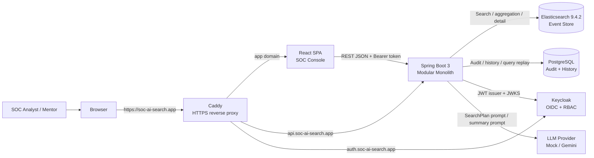
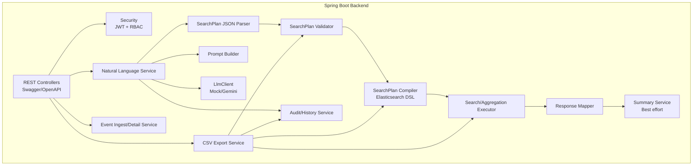
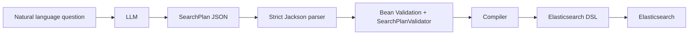
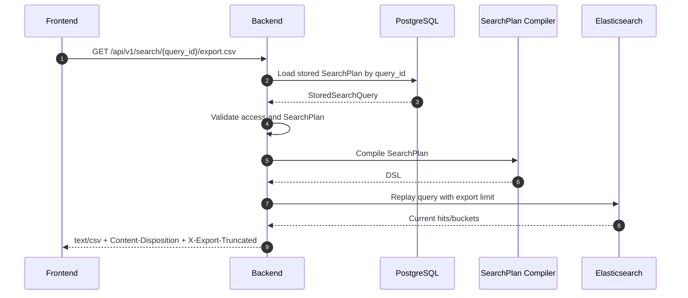
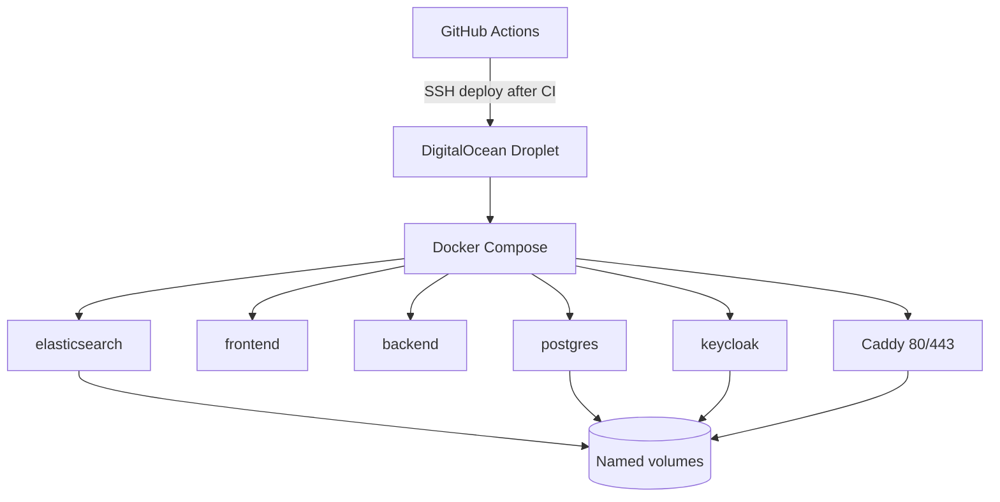

# 🏗️ System Architecture - SOC AI Search MVP

  
<b>📖 Table of Contents</b>

  - [📝 1. Executive Summary](#1-executive-summary)
  - [🏛️ 2. Macro Architecture](#2-macro-architecture)
  - [🌐 3. Domain Routing Matrix](#3-domain-routing-matrix)
  - [⚙️ 4. Backend Module Architecture](#4-backend-module-architecture)
  - [🗄️ 5. Data Store Taxonomy](#5-data-store-taxonomy)
    - [🔍 5.1. Elasticsearch](#51-elasticsearch)
    - [💾 5.2. PostgreSQL](#52-postgresql)
    - [🔑 5.3. Keycloak](#53-keycloak)
  - [🔒 6. SearchPlan Security Model](#6-searchplan-security-model)
  - [🤖 7. Intelligent Summary Architecture](#7-intelligent-summary-architecture)
  - [📤 8. Cryptographically Bounded CSV Export Architecture](#8-cryptographically-bounded-csv-export-architecture)
  - [🚢 9. Deployment Architecture](#9-deployment-architecture)

## 📝 1. Executive Summary

This document delineates the current architectural state of the SOC AI Search MVP. The ecosystem is composed of a modernized React frontend, a Spring Boot backend API, Elasticsearch, PostgreSQL, Keycloak for strict RBAC (Role-Based Access Control), structured CSV export capabilities, AI-driven summarization, and a robust CI/CD pipeline. The production environment is publicly deployed across a DigitalOcean infrastructure utilizing Name.com for DNS and Caddy for HTTPS termination.

## 🏛️ 2. Macro Architecture

The system fundamentally adheres to a **Modular Monolith** architectural pattern:

- ⚙️ A unified Spring Boot 3 backend encapsulates all business modules.
- 🖥️ The React frontend operates as an independent Single Page Application (SPA).
- 🗄️ Elasticsearch, PostgreSQL, Keycloak, Caddy, and the LLM engine operate as localized dependencies or managed runtime services.
- 🧱 Deliberate architectural constraint: The backend is intentionally not fragmented into microservices for the MVP phase.

## 🌐 3. Domain Routing Matrix

| Public Domain | Route Objective | Infrastructure Target |
| --- | --- | --- |
| `https://soc-ai-search.app` | Primary UI Application | Frontend Container |
| `https://api.soc-ai-search.app` | RESTful API & Swagger Docs | Backend Container |
| `https://auth.soc-ai-search.app` | OIDC Authorization & Admin Console | Keycloak Container |

*Security Context:* Caddy exclusively binds to public ports `80` and `443`. Internal service orchestration ports remain structurally isolated and are not publicly exposed.

## ⚙️ 4. Backend Module Architecture

 

**Imperative Guardrail:** All output originating from the LLM must successfully traverse both the strict Jackson Parser and the Bean Validation framework prior to the Compiler generating actionable Elasticsearch DSL.

## 🗄️ 5. Data Store Taxonomy

### 🔍 5.1. Elasticsearch

Elasticsearch serves as the authoritative repository for SOC event documents within the `soc-events-v1` index.

Primary Operational Responsibilities:

- 🔎 Execution of Full-text `match` queries against the `message` field.
- ⚡ High-velocity exact filtering on standardized keyword/IP fields.
- ⏱️ Highly optimized range queries executing against `timestamp` indices.
- 📊 Processing `terms` aggregations supporting `group_by` and `top_n` operations.
- 📈 Execution of `date_histogram` aggregations essential for time-series analytics.
- 🔬 Rapid extraction of Event Details mapped by the internal Elasticsearch `_id`.

### 💾 5.2. PostgreSQL

PostgreSQL functions strictly as the application state and metadata repository. It explicitly does **not** store SOC event documents.

Primary Relational Table:

- `search_query_logs`

Responsibilities:

- 📜 Maintaining comprehensive query histories.
- 🛡️ Serving as the immutable Audit Log.
- 🚨 Tracking query status and failure stage telemetries.
- 📸 Persisting validated SearchPlan snapshots.
- 🔨 Storing generated DSL snapshots (structurally capped to mitigate storage overflow).
- ⏱️ Recording executed result counts, operational latencies, and AI-generated summaries.
- 📤 Supplying foundational source data essential for CSV export replays bound to a specific `query_id`.

### 🔑 5.3. Keycloak

Keycloak operates as the centralized Identity Provider (IdP) managing user sessions and realm-level entitlements:

- `SOC_VIEWER`
- `SOC_ANALYST`
- `SOC_ADMIN`

The Backend inherently maps these roles extracted from `realm_access.roles` applying Spring Security's role hierarchy engine. The Frontend consumes this role context solely for UX element gating, while the Backend Authorization mechanism remains mathematically authoritative.

## 🔒 6. SearchPlan Security Model

**Enforced Guardrails:**

- 🚫 Hard rejection of anomalous or unknown JSON fields.
- 🚫 Denial of unsupported search modes or aggregation types.
- 🚫 Rejection of queries targeting unsupported filter or aggregation dimensions.
- 🚫 Active prohibition of `.keyword` modifiers, embedded scripts, wildcard expressions, or arbitrary query strings generated by the LLM.
- 🛑 Hardcap enforcement preventing queries attempting `size > 100`.
- ✂️ The backend unconditionally overrides pagination boundaries regardless of initial request directives.

## 🤖 7. Intelligent Summary Architecture

AI Summarization operates strictly as a best-effort augmentation:

- 🔎 Search Mode execution may dispatch a singular bounded aggregation query to generate statistical context.
- 📊 Aggregation Mode efficiently recycles pre-computed `aggregation_results` directly.
- 🗜️ The outbound data payload sent to the LLM is tightly compressed and thoroughly sanitized.
- ♻️ Should the LLM experience timeouts or generate invalid structures, the Backend gracefully returns a deterministic fallback summary, guaranteeing the search response lifecycle succeeds uninterrupted.

## 📤 8. Cryptographically Bounded CSV Export Architecture

The CSV export process operates on a rigid Query Replay architecture:

*Security Mandate:* Clients are explicitly forbidden from submitting dynamic or arbitrary DSL for CSV extraction purposes.

## 🚢 9. Deployment Architecture

  

**Production Hardening Protocols:**

- 🧱 The public-facing edge firewall exposes only ports `22`, `80`, and `443`.
- 🔏 Internal telemetry and database ports (Elasticsearch, PostgreSQL, Keycloak, internal applications) are heavily isolated.
- 🗝️ Cryptographic keys and operational secrets reside exclusively within secured VPS `.env` boundaries or GitHub Actions encrypted secrets.
- ⚠️ *Operational Warning:* Administrators must strictly avoid executing `docker compose down -v` unless executing a planned data purge.