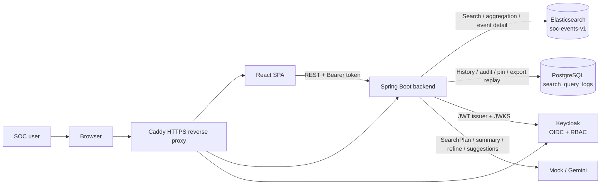
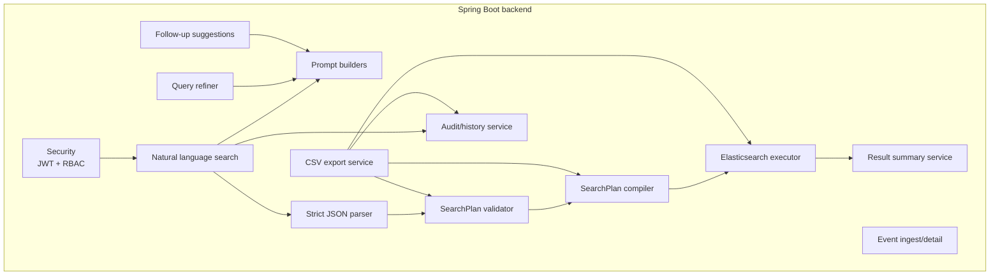
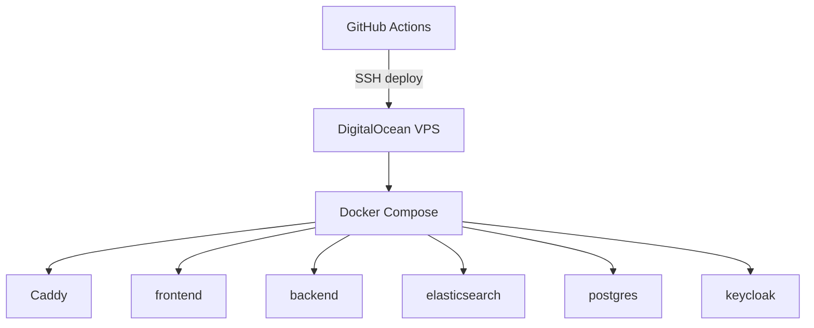

# System Architecture - SOC AI Search

## 1. Summary

SOC AI Search is a modular monolith application for SOC event search and investigation. The frontend is a React SPA. The backend is a Spring Boot API that owns all security-sensitive execution: authentication, SearchPlan validation, Elasticsearch DSL compilation, audit persistence, and CSV export replay.

The LLM is an assistant, not an executor. It can generate a `SearchPlan`, summary text, follow-up suggestions, or a refined natural language query, but it cannot directly query Elasticsearch.

## 2. High-Level Architecture

## 3. Runtime Boundaries

- The frontend never calls Elasticsearch or Gemini directly.
- The backend is the only component allowed to compile Elasticsearch DSL.
- Elasticsearch stores SOC event documents.
- PostgreSQL stores application metadata only.
- Keycloak owns identity, roles, and tokens.
- Caddy owns public HTTPS routing in production.

## 4. Backend Modules

Key backend responsibilities:

- Accept natural language requests.
- Build a constrained LLM prompt.
- Parse only pure JSON SearchPlan output.
- Reject unknown fields and unsafe expressions.
- Validate time ranges, filters, aggregation fields, pagination, and sort.
- Compile SearchPlan into Elasticsearch DSL.
- Execute Elasticsearch requests with bounded timeout.
- Persist audit/history in PostgreSQL.
- Replay stored SearchPlans for CSV export.

## 5. Data Stores

### Elasticsearch

Index: `soc-events-v1`

| Field | Type | Purpose |
| --- | --- | --- |
| `timestamp` | `date` | Time range, sort, time series |
| `source` | `keyword` | Filter and aggregation |
| `severity` | `keyword` | Filter, sort, aggregation |
| `event_type` | `keyword` | Filter and aggregation |
| `user` | `keyword` | Filter and aggregation |
| `host` | `keyword` | Filter and aggregation |
| `ip` | `ip` | IP filter and top IP |
| `country_code` | `keyword` | Filter and aggregation |
| `message` | `text` | Message text search |
| `raw` | `text`, not indexed | Forensic raw log payload |

### PostgreSQL

Main table: `search_query_logs`

Stores:

- `query_id`
- user identity
- original/display question
- mode and status
- validated SearchPlan
- generated DSL snapshot
- result count
- latency
- summary and summary source
- error message/failure stage
- pinned status

PostgreSQL does not store SOC event documents.

### Keycloak

Realm: `soc-ai-search`

Roles:

- `SOC_VIEWER`
- `SOC_ANALYST`
- `SOC_ADMIN`

The backend maps Keycloak realm roles into Spring Security authorities and enforces authorization server-side.

## 6. SearchPlan Security Model

Guardrails:

- LLM output must be a JSON object.
- Markdown/prose/trailing tokens are rejected.
- Unknown fields are rejected.
- Unsupported filters and aggregations are rejected.
- `script`, wildcard, query string, `.keyword`, and unsafe expressions are rejected.
- Relative time supports `now`, `now-<n>h`, and `now-<n>d` with limits.
- Backend overrides pagination boundaries.
- DSL is generated only by backend code.

## 7. Frontend Architecture

Main user-facing areas:

- Dashboard
- Event Search
- Query Transparency
- Query Result
- Query Library
- All Investigations
- Recent Queries
- System Audit Logs
- Event Detail Drawer

Important UI flows:

- Query Breakdown visualizes SearchPlan fields in a human-readable table.
- Validated SearchPlan and Compiled DSL remain available for transparency.
- Correct or Refine Query lets users add feedback and rerun the safe pipeline.
- Result filter/sort reruns a validated SearchPlan without asking the LLM for a new natural language plan.
- Query Library provides curated demo queries based on the synthetic dataset.
- AI Follow-up Suggestions provide three LLM-generated next investigation ideas when available.

## 8. Deployment Architecture

Production public domains:

- `https://soc-ai-search.app`
- `https://api.soc-ai-search.app`
- `https://auth.soc-ai-search.app`

Only ports `22`, `80`, and `443` should be publicly reachable.
