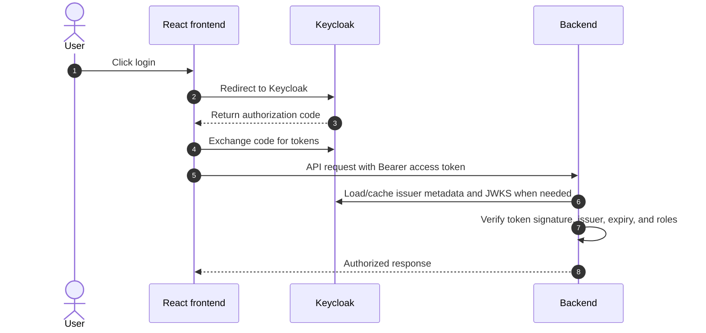

# Authentication and Identity Onboarding

## 1. Overview

SOC AI Search uses Keycloak as the identity provider.

Production auth domain:

```text
https://auth.soc-ai-search.app
```

Local auth domain:

```text
http://localhost:8082
```

Keycloak realm:

```text
soc-ai-search
```

Frontend client:

```text
soc-ai-search-frontend
```

## 2. Roles

| Role | Purpose |
| --- | --- |
| `SOC_VIEWER` | Read-only user. Can search and inspect event results. |
| `SOC_ANALYST` | Investigation user. Can edit SearchPlan, pin history, access investigations, and export result CSV. |
| `SOC_ADMIN` | Administrative user. Inherits analyst capabilities and can access system audit logs. |

## 3. Login Flow



The frontend obtains the access token through the Keycloak OIDC flow. API requests attach this access token as a Bearer token. The backend validates JWTs with Spring Security using the issuer and JWKS configuration; it does not call the Keycloak admin API for normal request authorization.

## 4. Token Renewal

Keycloak does not extend the same access token forever. It issues a new access token when the frontend refreshes the session using the refresh token/session state.

Important points:

- Access tokens are short-lived.
- Refresh token/session is used to obtain a new access token.
- Backend validates each access token independently.
- If refresh fails, the user must log in again.

## 5. User Provisioning

Recommended demo workflow:

1. Admin opens Keycloak Admin Console.
2. Select realm `soc-ai-search`.
3. Create user.
4. Set username, email, first name, last name.
5. Assign one realm role:
   - `SOC_VIEWER`
   - `SOC_ANALYST`
   - `SOC_ADMIN`
6. Set a temporary password or send required-action email if SMTP is configured.
7. User logs in and changes password if required.

## 6. SMTP Onboarding

SMTP is optional for the demo. If configured, Keycloak can send:

- verify email
- update password
- forgot password

For local/dev, Mailtrap is a safe choice because it captures email in a sandbox inbox.

For production/demo, a real SMTP provider can be configured in Keycloak Realm Settings -> Email.

Do not commit SMTP passwords or demo user passwords.

## 7. Redirect URI Requirements

The Keycloak client `soc-ai-search-frontend` must allow:

Local:

```text
http://localhost:3000/*
http://localhost:5173/*
```

Production:

```text
https://soc-ai-search.app/*
```

Post logout redirect should include:

```text
https://soc-ai-search.app
http://localhost:3000
```

If these are missing, Keycloak may show:

```text
Invalid redirect uri
```

## 8. Security Notes

- UI hiding is not security. Backend role checks are authoritative.
- Demo credentials must be shared out of band.
- Do not commit `.env` files with real secrets.
- Admin users should be limited during demos.
- Keycloak admin console should be available only to trusted admins.
