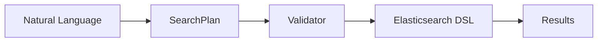
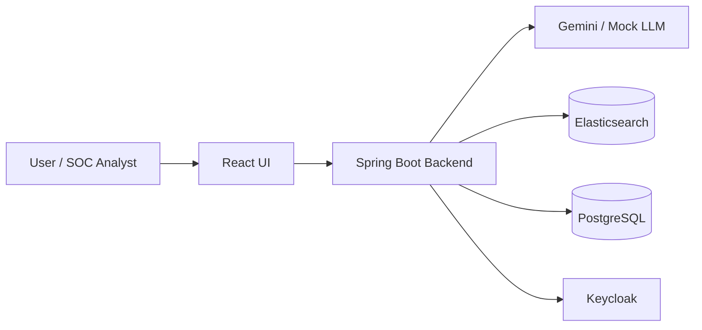
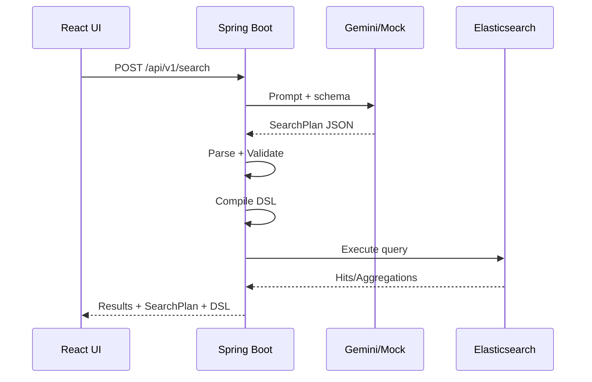
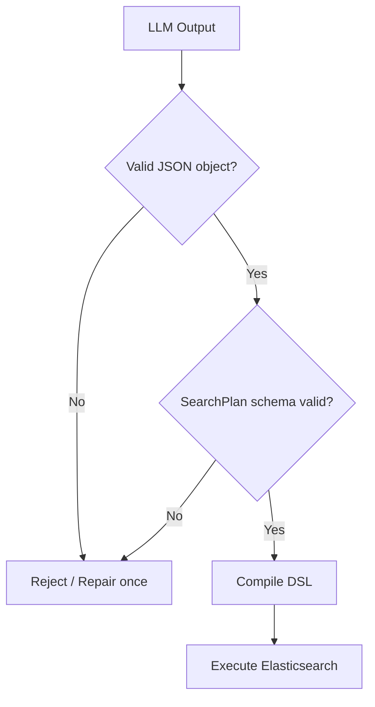
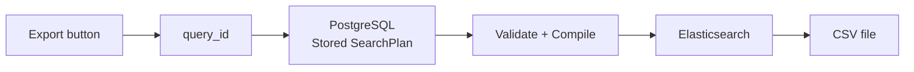
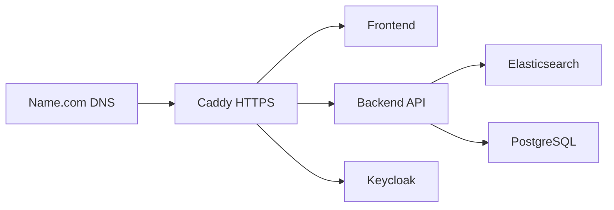
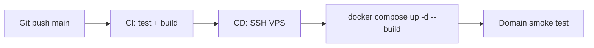

# Outline Slide Bảo Vệ - SOC AI Search

Mục tiêu của bộ slide: **ít chữ, nhiều hình, kể được câu chuyện từ vấn đề SOC thực tế đến hệ thống chạy thật**. Hội đồng không cần đọc tài liệu trên slide; họ cần nhìn thấy vấn đề, kiến trúc, guardrail AI, demo UI và kết quả triển khai.

Số slide khuyến nghị: **15-20 slide**. Bản outline này dùng **20 slide**.

## Nguyên Tắc Thiết Kế Slide

- Mỗi slide chỉ có **1 thông điệp chính**.
- Ưu tiên hình ảnh:
  - architecture diagram;
  - UI screenshots;
  - SearchPlan -> DSL flow;
  - RBAC table;
  - CI/CD pipeline.
- Mỗi slide tối đa 3-5 bullet ngắn.
- Dùng theme dark SOC: nền đen/xám đậm, accent cyan/purple, badge xanh/đỏ/vàng theo trạng thái.
- Code/JSON chỉ đưa đoạn ngắn, đủ để hội đồng hiểu ý tưởng.
- Demo thật nên chiếm khoảng **40-50% thời gian trình bày**.

## Câu Chuyện Chính Cần Kể

> SOC analyst không nên phải viết Elasticsearch DSL thủ công. Hệ thống cho phép hỏi bằng ngôn ngữ tự nhiên, nhưng không để AI truy vấn dữ liệu trực tiếp. AI chỉ sinh `SearchPlan`; backend validate, compile DSL, enforce RBAC/audit rồi mới execute.

Đây là điểm ăn tiền của đồ án: **AI hỗ trợ điều tra, backend giữ quyền kiểm soát an toàn**.

---

## Slide 1 - Title

**Thông điệp:** Đây là hệ thống SOC AI Search chạy thật, không chỉ là prototype.

**Nội dung trên slide:**

- SOC AI Search
- Natural Language Search for Security Events
- Tên sinh viên, lớp, mentor/GVHD

**Hình nên dùng:**

- Screenshot landing page hoặc dashboard dark theme.

**Bạn nói:**

- Giới thiệu ngắn: hệ thống giúp SOC analyst tìm kiếm và thống kê log bảo mật bằng ngôn ngữ tự nhiên.

---

## Slide 2 - Problem: SOC Analyst Đang Gặp Gì?

**Thông điệp:** Dữ liệu log nhiều, query phức tạp, thời gian điều tra bị kéo dài.

**Nội dung trên slide:**

- Millions of logs
- Complex DSL
- Slow investigation
- High risk of mistakes

**Hình nên dùng:**

- Hình minh họa log/security alerts dày đặc.
- Hoặc ảnh Elasticsearch DSL dài.

**Bạn nói:**

- SOC analyst phải xử lý nhiều cảnh báo.
- Viết DSL thủ công dễ sai và khó cho người mới.

---

## Slide 3 - Goal

**Thông điệp:** Chuyển từ “viết query” sang “hỏi và kiểm soát kết quả”.

**Nội dung trên slide:**

- Ask in English/Vietnamese
- Validate SearchPlan
- Compile safe DSL
- Audit every query

**Hình nên dùng:**

- Flow đơn giản:



**Bạn nói:**

- Điểm khác biệt là không cho LLM sinh DSL chạy trực tiếp.

---

## Slide 4 - High-Level Architecture

**Thông điệp:** Hệ thống có kiến trúc đầy đủ: frontend, backend, LLM, ES, PostgreSQL, Keycloak, CI/CD.

**Nội dung trên slide:**

- React UI
- Spring Boot API
- Elasticsearch
- PostgreSQL Audit
- Keycloak RBAC
- Gemini/Mock LLM

**Hình nên dùng:**



**Bạn nói:**

- Frontend không gọi ES/LLM trực tiếp.
- Backend là nơi enforce guardrail.

---

## Slide 5 - Core Flow: NL -> SearchPlan -> DSL

**Thông điệp:** Đây là trái tim kỹ thuật của đồ án.

**Nội dung trên slide:**

- User question
- LLM SearchPlan
- Backend validation
- DSL compiler
- Search/Aggregation result

**Hình nên dùng:**



**Bạn nói:**

- Nếu LLM sai JSON, backend reject hoặc repair tối đa 1 lần.
- Nếu vẫn sai, trả lỗi có kiểm soát.

---

## Slide 6 - SearchPlan Contract

**Thông điệp:** `SearchPlan` là lớp trung gian an toàn giữa AI và Elasticsearch.

**Nội dung trên slide:**

```json
{
  "mode": "search",
  "filters": {
    "timestamp": { "from": "now-24h", "to": "now" },
    "event_type": ["failed_login"],
    "country_code": ["CN"]
  },
  "page": 0,
  "size": 10
}
```

**Hình nên dùng:**

- Screenshot Query Transparency panel: SearchPlan tab.

**Bạn nói:**

- Analyst có thể hiểu SearchPlan dễ hơn DSL.
- DSL vẫn read-only để tránh bypass guardrail.

---

## Slide 7 - AI Guardrails

**Thông điệp:** Hệ thống dùng AI nhưng không tin AI tuyệt đối.

**Nội dung trên slide:**

- Reject unknown fields
- Reject markdown/prose
- Validate enum/size/top_n
- Backend overrides page/size
- DSL generated only by backend

**Hình nên dùng:**



**Bạn nói:**

- Đây là phần hội đồng thường hỏi: “Nếu AI sinh sai thì sao?”.
- Trả lời: parser + validator + compiler kiểm soát.

---

## Slide 8 - Search UI Demo

**Thông điệp:** Người dùng hỏi tự nhiên và thấy kết quả ngay.

**Nội dung trên slide:**

- Natural language query
- Raw events
- Query transparency
- AI summary

**Hình nên dùng:**

- Screenshot Event Search page sau khi chạy:
  - câu hỏi;
  - KPI cards;
  - AI summary;
  - Raw Events table.

**Bạn nói:**

- Demo câu: `Show me failed login attempts from China in the last 24h`.

---

## Slide 9 - Aggregation & Chart Mapping

**Thông điệp:** Hệ thống không chỉ search raw logs, mà còn thống kê dữ liệu SOC.

**Nội dung trên slide:**

| User Intent | Aggregation | Chart |
| --- | --- | --- |
| Count events | `count` | Number |
| Group by user/severity | `group_by` | Bar |
| Top IP/host | `top_n` | Bar |
| Events over time | `date_histogram` | Line |

**Hình nên dùng:**

- Screenshot biểu đồ bar hoặc line từ UI.

**Bạn nói:**

- Compiler tự sinh terms/date_histogram DSL.
- Không cho LLM sinh DSL aggregation trực tiếp.

---

## Slide 10 - SOC Overview Dashboard

**Thông điệp:** Dashboard dùng aggregation API có sẵn, không gọi LLM.

**Nội dung trên slide:**

- Total Events
- Failed Logins
- Severity Distribution
- Top Source IPs
- Events Over Time

**Hình nên dùng:**

- Screenshot dashboard overview.

**Bạn nói:**

- Dashboard auto-refresh 10 phút.
- Nếu một card lỗi, các card khác vẫn chạy.

---

## Slide 11 - Investigation Workflow

**Thông điệp:** Query không biến mất sau khi search; mọi thứ được lưu để audit và replay.

**Nội dung trên slide:**

- Recent Queries
- All Investigations
- Pin/Unpin
- SearchPlan + DSL detail
- Run Again / Export CSV

**Hình nên dùng:**

- Screenshot All Investigations master-detail.

**Bạn nói:**

- PostgreSQL lưu question, SearchPlan, DSL, status, latency, summary.
- Đây là audit trail phục vụ truy vết.

---

## Slide 12 - Human-in-the-loop: Editable SearchPlan

**Thông điệp:** Khi AI sinh gần đúng nhưng chưa hoàn hảo, analyst có thể chỉnh SearchPlan an toàn.

**Nội dung trên slide:**

- Analyst edits SearchPlan
- Backend validates again
- DSL regenerated
- No direct DSL editing

**Hình nên dùng:**

- Screenshot SearchPlan editor nếu có.

**Bạn nói:**

- Viewer không được edit.
- Analyst/Admin được edit SearchPlan, nhưng vẫn không thể bypass validator.

---

## Slide 13 - RBAC & Security

**Thông điệp:** Quyền được kiểm soát theo vai trò bằng Keycloak.

**Nội dung trên slide:**

| Capability | Viewer | Analyst | Admin |
| --- | :---: | :---: | :---: |
| Search | Yes | Yes | Yes |
| Edit SearchPlan | No | Yes | Yes |
| Export CSV | No | Yes | Yes |
| Pin Investigation | No | Yes | Yes |
| Audit Logs | No | No | Yes |

**Hình nên dùng:**

- RBAC table.
- Screenshot user role badge trên UI.

**Bạn nói:**

- Backend vẫn enforce RBAC, không chỉ ẩn nút trên UI.

---

## Slide 14 - Secure CSV Export

**Thông điệp:** Export không nhận DSL tùy ý từ client.

**Nội dung trên slide:**

- Export by `query_id`
- Replay stored SearchPlan
- Validate + compile again
- Max 10,000 rows

**Hình nên dùng:**



**Bạn nói:**

- Đây là cách tránh client gửi DSL độc hại.

---

## Slide 15 - Deployment Architecture

**Thông điệp:** Hệ thống đã deploy public thật, có domain và HTTPS.

**Nội dung trên slide:**

- DigitalOcean VPS
- Docker Compose
- Caddy HTTPS
- Name.com DNS
- Keycloak + Backend + Frontend

**Hình nên dùng:**



**Bạn nói:**

- Không dùng AWS/Nginx/Certbot trong bản deploy hiện tại.
- Caddy tự cấp HTTPS.

---

## Slide 16 - CI/CD Pipeline

**Thông điệp:** Code push lên GitHub có kiểm thử và deploy tự động.

**Nội dung trên slide:**

- GitHub Actions
- Backend tests
- Frontend tests/build
- Docker Compose config
- Deploy to VPS
- Smoke test domain

**Hình nên dùng:**



**Bạn nói:**

- Smoke test giúp phát hiện lỗi deploy/domain/API sớm.

---

## Slide 17 - Testing & Quality

**Thông điệp:** Hệ thống có test ở backend, frontend và smoke/integration.

**Nội dung trên slide:**

- Unit tests
- Controller/service tests
- Frontend component tests
- Smoke tests
- JaCoCo coverage

**Hình nên dùng:**

- Screenshot JaCoCo report.
- Screenshot GitHub Actions pass.

**Bạn nói:**

- Test tập trung business logic: validator, compiler, executor, RBAC, audit, CSV.

---

## Slide 18 - Results, Limitations & Future Work

**Thông điệp:** MVP đã hoàn thiện core, còn hướng mở rộng rõ ràng.

**Nội dung trên slide:**

**Achieved**
- NL search + aggregation
- Guarded SearchPlan pipeline
- Dashboard + Investigations
- RBAC + audit + deploy

**Future**
- Multi-turn investigation
- Advanced aggregations
- Saved dashboards
- Real-time streaming
- PDF incident report

**Hình nên dùng:**

- Một collage nhỏ gồm UI screenshots.

**Bạn nói:**

- Nhấn mạnh MVP đã chạy thật, có public deploy, có bảo mật, có kiểm thử.

---

## Slide 19 - Live Demo Script

**Thông điệp:** Chuẩn bị sẵn luồng demo để nói mượt.

**Nội dung trên slide:**

1. Login analyst.
2. Search failed login China.
3. Show SearchPlan + DSL.
4. Run top IP aggregation.
5. Open Dashboard.
6. Pin query in Investigations.
7. Export CSV.
8. Login viewer/admin if time allows.

**Hình nên dùng:**

- Không cần nhiều chữ; có thể dùng timeline ngang.

**Bạn nói:**

- Đây là slide chuyển sang live demo.

---

## Slide 20 - Q&A

**Thông điệp:** Kết thúc gọn và tự tin.

**Nội dung trên slide:**

- Thank you
- Q&A
- GitHub / Demo URL nếu được phép

**Hình nên dùng:**

- Logo dự án hoặc screenshot hero page.

---

## Các Hình Ảnh Nên Chuẩn Bị

1. Landing page hoặc login/auth gateway.
2. Event Search page sau khi search thành công.
3. Query Transparency: SearchPlan và DSL.
4. Raw Events table.
5. Aggregation chart: bar.
6. Aggregation chart: line.
7. SOC Overview Dashboard.
8. All Investigations page.
9. Audit Logs page.
10. Keycloak login/role badge.
11. GitHub Actions pass.
12. JaCoCo coverage report.
13. DigitalOcean/Caddy/domain public deployment.

## Bộ Câu Demo Khuyến Nghị

Search:

```text
Show me failed login attempts from China in the last 24h
```

Aggregation bar:

```text
Show the top 10 source IPs with the most alerts in the last 30 days
```

Aggregation line:

```text
Show failed login trend by hour in the last 24 hours
```

SearchPlan edit:

```text
Show high severity events for user admin in the last 2 days
```

## Câu Trả Lời Mẫu Cho Câu Hỏi Khó

**Nếu AI sinh sai thì sao?**

> LLM không được execute query trực tiếp. Output của LLM phải là SearchPlan JSON. Backend parse, reject unknown fields, validate enum/range/aggregation rules, sau đó compiler mới sinh DSL. Nếu LLM sai, request bị reject hoặc repair tối đa một lần.

**Nếu người dùng cố tình sửa SearchPlan độc hại thì sao?**

> SearchPlan edited by user vẫn đi qua cùng validator và compiler. DSL không cho edit trực tiếp, nên không thể bypass backend guardrails.

**Tại sao không cho LLM sinh Elasticsearch DSL luôn?**

> Vì DSL có thể chứa field/query nguy hiểm hoặc không kiểm soát. SearchPlan là contract trung gian giúp hệ thống allowlist field, kiểm soát aggregation, pagination, RBAC và audit.

**Dữ liệu export CSV có an toàn không?**

> Export chỉ nhận query_id, sau đó backend replay SearchPlan đã lưu. Client không gửi DSL tùy ý. Export có giới hạn 10,000 rows.

**Dashboard có gọi LLM không?**

> Không. Dashboard dùng aggregation API cố định, chạy nhanh và ổn định. LLM chỉ dùng cho natural language search và summary best-effort.

## Gợi Ý Công Cụ Làm Slide

- **PowerPoint:** dễ kiểm soát layout, phù hợp bảo vệ.
- **Canva:** nhanh, đẹp, nhiều template cybersecurity.
- **Figma:** tốt nếu muốn đồng bộ với UI dark theme.
- **Slidev/Marp:** đẹp cho code/diagram nhưng cần kiểm soát thời gian.

Khuyến nghị thực tế: dùng **PowerPoint hoặc Canva**, nhúng screenshot UI thật và Mermaid diagram đã export thành PNG/SVG.
