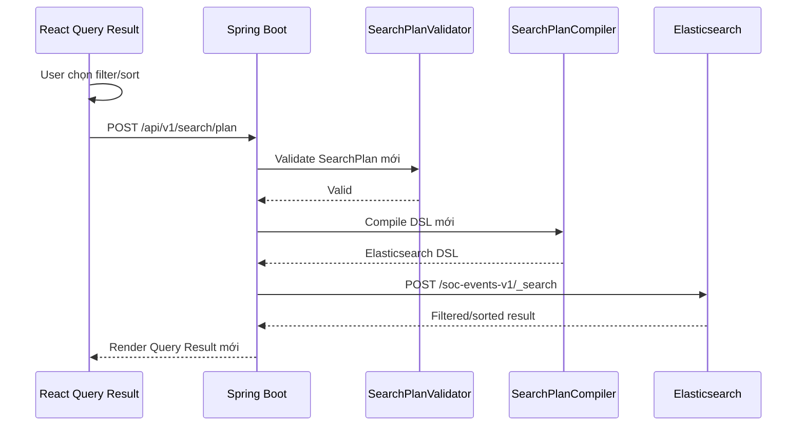

# Q20 - Filter / Sort kết quả Search và Aggregation

## 1. Vì sao cần filter/sort ở Query Result?

Sau khi user search, bảng kết quả có thể có hàng trăm hoặc hàng nghìn event. Nếu chỉ xem 10 dòng mỗi trang thì analyst khó khoanh vùng nhanh.

Vì vậy Query Result có thêm `Result Controls` để analyst lọc và sắp xếp lại kết quả.

Điểm quan trọng: hệ thống không chỉ filter/sort 10 dòng đang hiển thị ở frontend. Khi bấm `Apply Filters`, frontend tạo lại `SearchPlan`, backend validate, compile DSL mới và query lại Elasticsearch. Do đó kết quả đúng trên toàn bộ dataset.

## 2. Field nào dùng dropdown, field nào dùng text input?

Các field có tập giá trị nhỏ và tương đối cố định dùng dropdown/toggle:

- `severity`: `critical`, `high`, `medium`, `low`
- `event_type`: `failed_login`, `account_lockout`, `firewall_block`, `malware_detected`, ...

Các field có cardinality cao, không biết trước giá trị dùng text input:

- `user`
- `host`
- `ip`
- `country_code`
- `message_query`

Lý do: user/host/ip trong log thực tế có thể rất nhiều. Không nên hardcode toàn bộ vào dropdown.

## 3. Flow khi bấm Apply Filters



## 4. Search mode filter/sort hiện hỗ trợ gì?

Filter:

- `severity`
- `event_type`
- `user`
- `host`
- `ip`
- `country_code`
- `message_query`

Sort:

- `timestamp desc`: newest first
- `timestamp asc`: oldest first
- `severity desc`: highest severity first
- `severity asc`: lowest severity first

Ví dụ SearchPlan sau khi apply:

```json
{
  "mode": "search",
  "filters": {
    "timestamp": { "from": "now-24h", "to": "now" },
    "severity": ["high", "critical"],
    "event_type": ["failed_login"],
    "user": "admin",
    "ip": "203.0.113.45"
  },
  "message_query": "brute force",
  "sort": [{ "field": "timestamp", "order": "desc" }],
  "page": 0,
  "size": 10
}
```

Backend compiler sinh DSL sort:

```json
{
  "sort": [{ "timestamp": { "order": "desc" } }]
}
```

## 5. Aggregation mode filter/sort hiện hỗ trợ gì?

Aggregation vẫn dùng các filter chung:

- `severity`
- `event_type`
- `user`
- `host`
- `ip`
- `country_code`

Với `group_by` và `top_n`, UI hỗ trợ:

- sort bucket theo `value desc`: bucket lớn nhất trước;
- sort bucket theo `value asc`: bucket nhỏ nhất trước;
- sort bucket theo `key asc`: A-Z;
- sort bucket theo `key desc`: Z-A;
- chọn `top_n`: 5, 10, 20, 50.

Ví dụ:

```json
{
  "mode": "aggregation",
  "filters": {
    "timestamp": { "from": "now-24h", "to": "now" },
    "severity": ["high"]
  },
  "aggregation": {
    "type": "top_n",
    "field": "ip",
    "top_n": 5,
    "order_by": "value",
    "order": "desc"
  },
  "page": 0,
  "size": 10
}
```

Backend compiler map:

- `order_by = value` thành Elasticsearch `_count`;
- `order_by = key` thành Elasticsearch `_key`;
- `order = asc/desc` giữ nguyên.

DSL terms aggregation:

```json
{
  "terms": {
    "field": "ip",
    "size": 5,
    "order": { "_count": "desc" }
  }
}
```

## 6. Vì sao date_histogram không cho sort tùy ý?

`date_histogram` dùng cho line chart/time-series. Trục thời gian phải đi từ cũ đến mới, nên backend cố định:

```json
{
  "order": { "_key": "asc" }
}
```

Nếu cho sort theo value, line chart sẽ bị sai ý nghĩa thời gian.

## 7. Guardrail bảo mật

Backend validate sort/filter trước khi compile DSL:

- sort chỉ được dùng trong `mode = search`;
- sort field phải nằm trong allowlist;
- không cho sort theo `message`, `raw`;
- không cho wildcard/script trong các value nguy hiểm;
- aggregation order chỉ áp dụng cho `group_by` và `top_n`.

Điều này giữ nguyên nguyên tắc: frontend không gửi DSL tùy ý, chỉ gửi SearchPlan đã được backend kiểm soát.

## 8. Code liên quan

Backend:

- `backend/src/main/java/com/soc/ai/search/search/plan/SearchPlan.java`
- `backend/src/main/java/com/soc/ai/search/search/plan/SortPlan.java`
- `backend/src/main/java/com/soc/ai/search/search/plan/SortOrder.java`
- `backend/src/main/java/com/soc/ai/search/search/plan/AggregationPlan.java`
- `backend/src/main/java/com/soc/ai/search/search/plan/AggregationOrderBy.java`
- `backend/src/main/java/com/soc/ai/search/search/validation/SearchPlanValidator.java`
- `backend/src/main/java/com/soc/ai/search/search/compiler/SearchPlanCompiler.java`

Frontend:

- `frontend/src/components/soc/result-tabs.tsx`
- `frontend/src/services/search-plan-api.ts`
- `frontend/src/App.tsx`
- `frontend/src/types/soc.ts`

Tests:

- `backend/src/test/java/com/soc/ai/search/search/validation/SearchPlanValidatorTest.java`
- `backend/src/test/java/com/soc/ai/search/search/compiler/SearchPlanCompilerTest.java`
- `backend/src/test/java/com/soc/ai/search/search/plan/SearchPlanJacksonTest.java`
- `frontend/src/components/soc/result-tabs.test.tsx`

## 9. Câu trả lời ngắn khi hội đồng hỏi

**Filter/sort này có đúng toàn bộ dữ liệu hay chỉ 10 dòng hiện tại?**

Đúng toàn bộ dữ liệu. UI cập nhật SearchPlan và gọi lại backend. Backend validate, compile DSL mới và query Elasticsearch lại.

**Vì sao user/host/ip không dùng dropdown?**

Vì đây là field cardinality cao, giá trị phát sinh theo log thực tế. Dùng text input hoặc autocomplete sẽ hợp lý hơn hardcode dropdown.

**Vì sao aggregation date_histogram không sort theo count?**

Vì date_histogram là time-series. Nếu sort theo count thì line chart mất thứ tự thời gian và sai ý nghĩa giám sát SOC.
