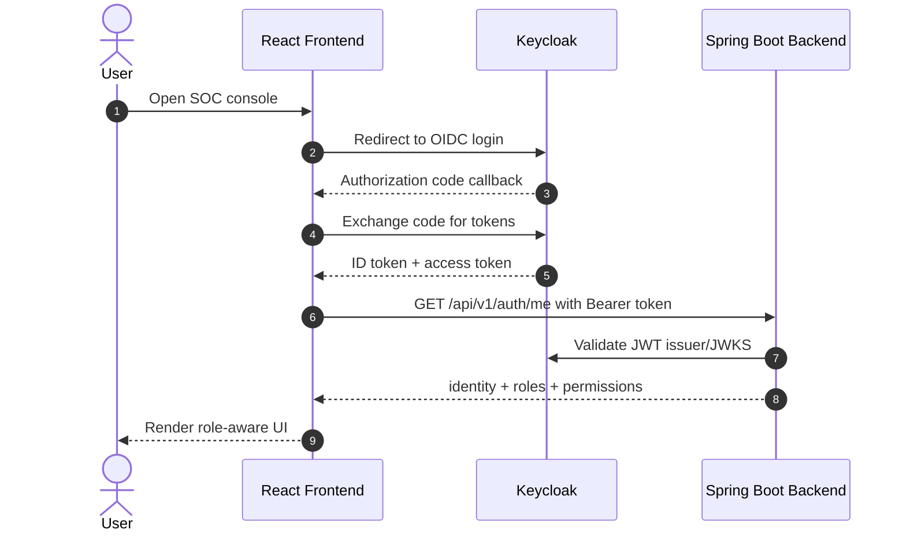
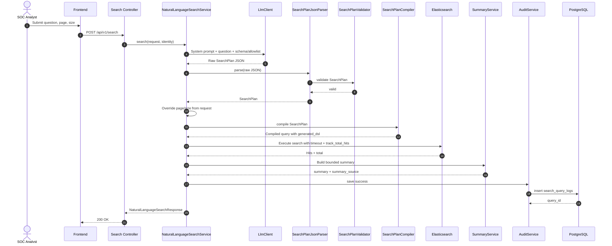
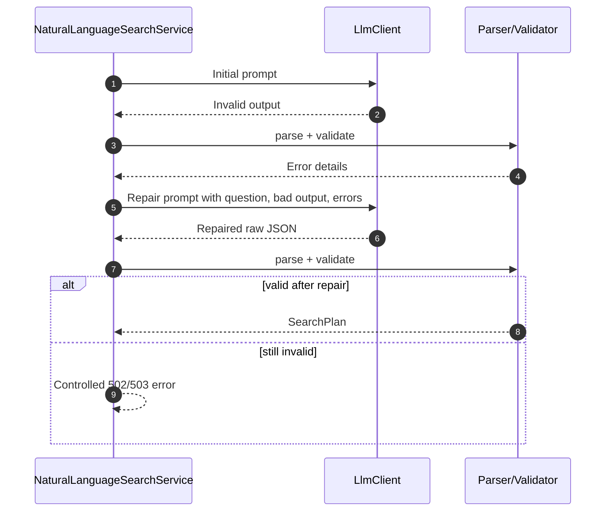
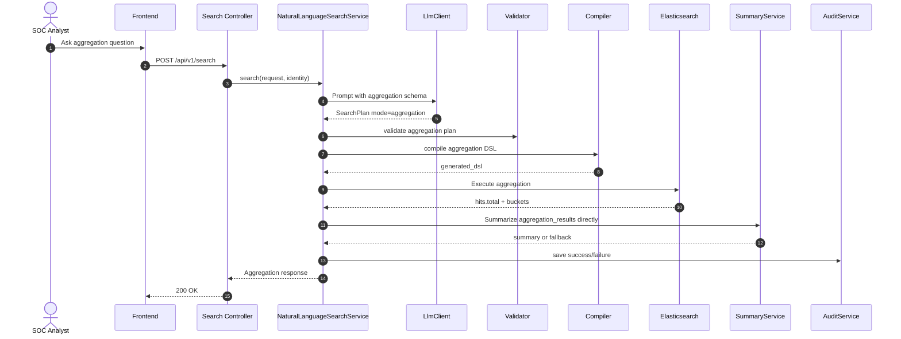
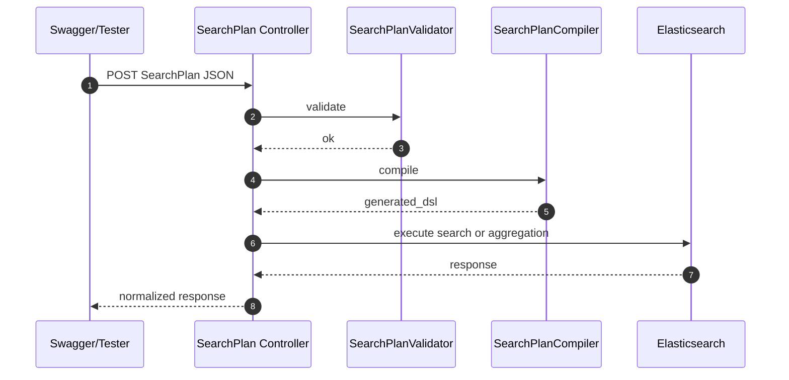
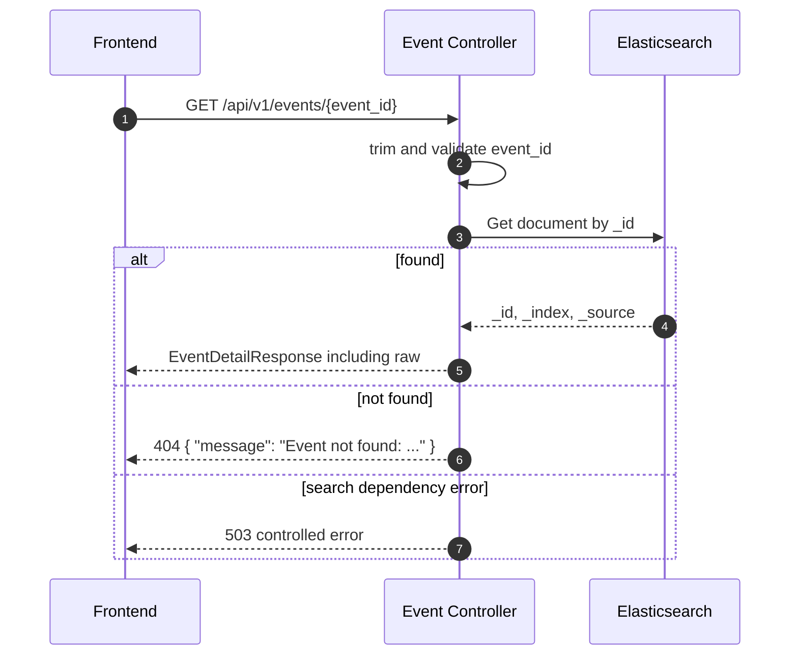
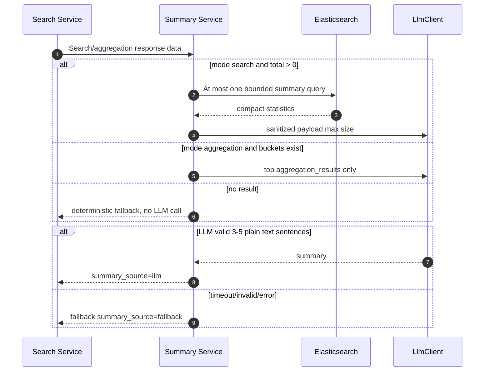
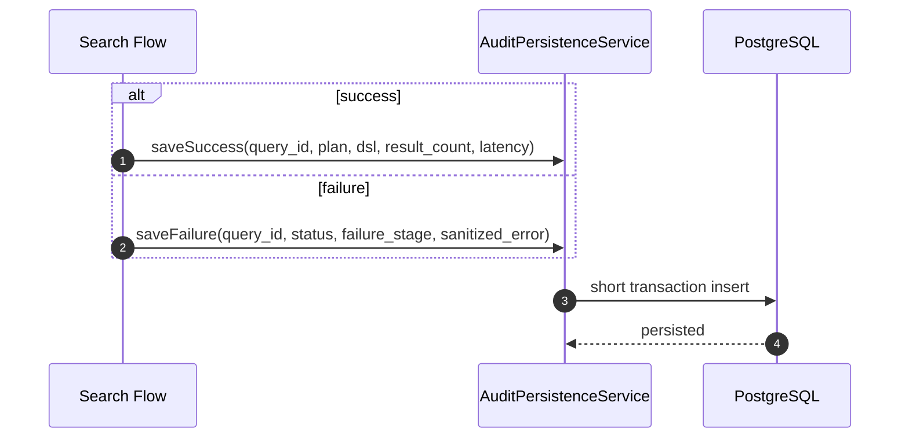
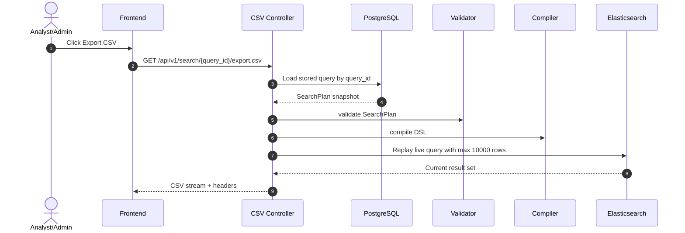

# Sequence Flow - SOC AI Search MVP

## 1. Tổng quan

Tài liệu này mô tả các flow runtime chính của SOC AI Search MVP:

1. Login và RBAC.
2. Natural language search.
3. Natural language aggregation.
4. Technical SearchPlan endpoint.
5. Event detail.
6. Summary best-effort.
7. Audit/history.
8. CSV export.

Contract API dùng JSON snake_case như `query_id`, `original_question`, `generated_dsl`, `search_plan`, `aggregation_results`, `chart_metadata`.

## 2. Login và RBAC



Backend authorization remains authoritative even if frontend hides or disables UI actions.

## 3. Natural language search



Search response shape:

```json
{
  "query_id": "uuid",
  "original_question": "Show me failed login attempts from China in the last 24h",
  "mode": "search",
  "search_plan": {},
  "generated_dsl": {},
  "summary": "...",
  "summary_source": "llm",
  "total": 123,
  "page": 0,
  "size": 20,
  "total_pages": 7,
  "llm_latency_ms": 50,
  "search_latency_ms": 30,
  "latency_ms": 100,
  "events": []
}
```

## 4. Repair once flow



Repair is limited to one attempt.

## 5. Natural language aggregation



Aggregation response shape:

```json
{
  "query_id": "uuid",
  "original_question": "Top 10 IP có nhiều alert nhất tháng này",
  "mode": "aggregation",
  "search_plan": {},
  "generated_dsl": {},
  "summary": "...",
  "summary_source": "fallback",
  "total": 438,
  "aggregation_type": "top_n",
  "aggregation_results": [
    { "key": "10.0.0.5", "value": 124 }
  ],
  "chart_metadata": {
    "chart_type": "BAR",
    "x_axis_label": "ip",
    "y_axis_label": "count"
  },
  "events": []
}
```

## 6. Technical SearchPlan endpoint

Endpoint:

```text
POST /api/v1/search/plan
```

This endpoint is for validating the SearchPlan core without LLM.



## 7. Event detail



## 8. Summary best-effort



## 9. Audit and history



History endpoint:

```text
GET /api/v1/search/history?page=0&size=20
```

Audit endpoint:

```text
GET /api/v1/audit-logs?page=0&size=50
```

Both return paged response with `items`, `page`, `size`, `total`, `total_pages`.

## 10. CSV export



CSV headers exposed to browser:

- `Content-Disposition`
- `X-Export-Truncated`

## 11. Error handling principles

- Bad request: 400 with clear message.
- Unauthorized: 401.
- Forbidden by role: 403.
- Event not found: 404.
- LLM unavailable or invalid after repair: controlled 502/503.
- Elasticsearch dependency error: controlled 503.
- No stack trace or internal exception class in API response.