# Sequence Flows - SOC AI Search

## 1. Authentication and RBAC

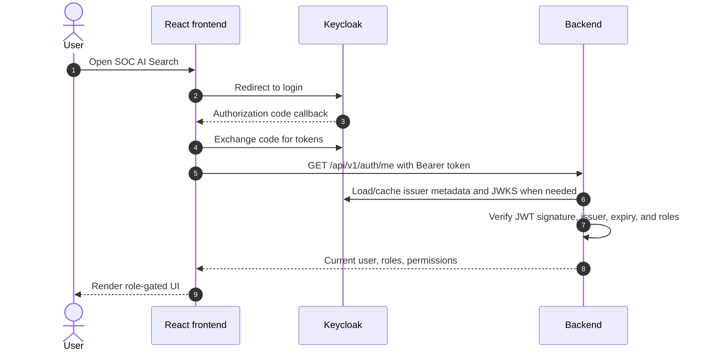

Backend role checks remain authoritative. UI gating is for user experience only.

## 2. Natural Language Search

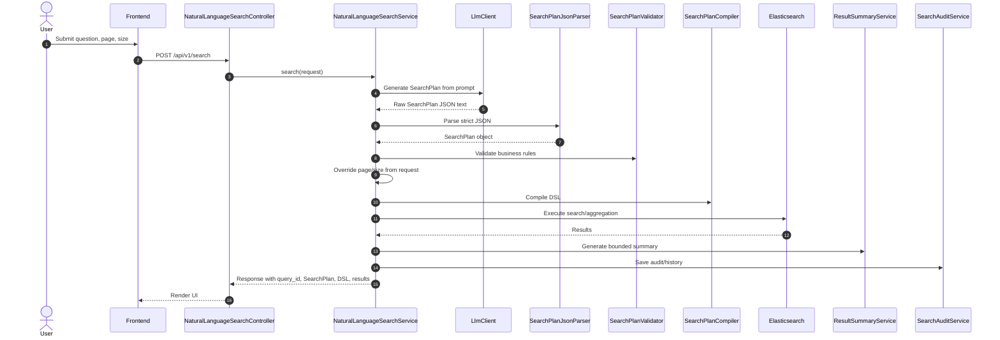

Important outputs:

- `query_id`
- `search_plan`
- `generated_dsl`
- `summary`
- `events` or `aggregation_results`
- `chart_metadata`

## 3. LLM Repair-Once Flow

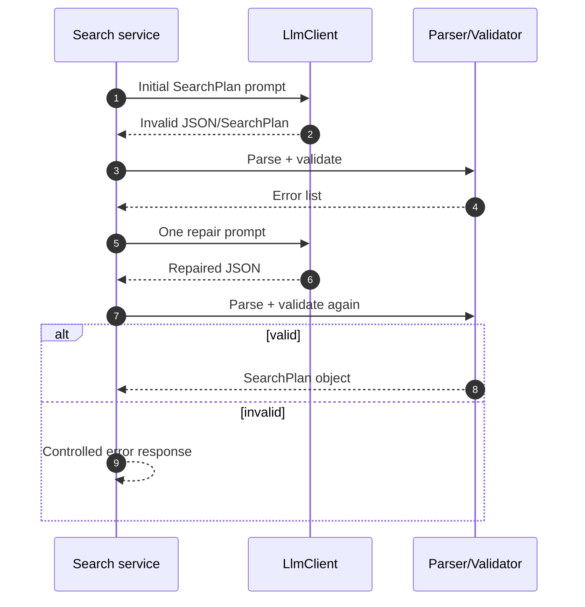

The repair flow is capped to avoid infinite retry loops.

## 4. Direct SearchPlan Execution

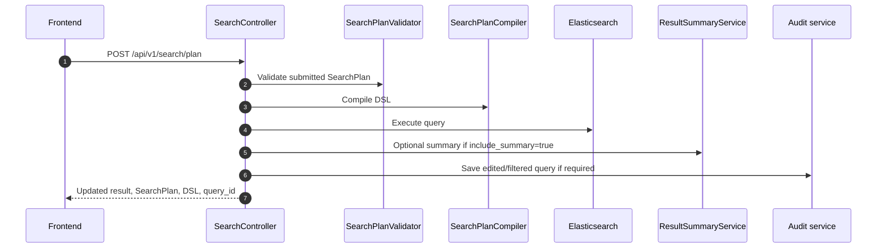

This endpoint is used for:

- Editable SearchPlan reruns.
- Result filter/sort reruns.
- Technical testing of the validator/compiler/executor without LLM SearchPlan generation.

Pagination-only changes do not need to create a new audit record.

## 5. Correct or Refine Query

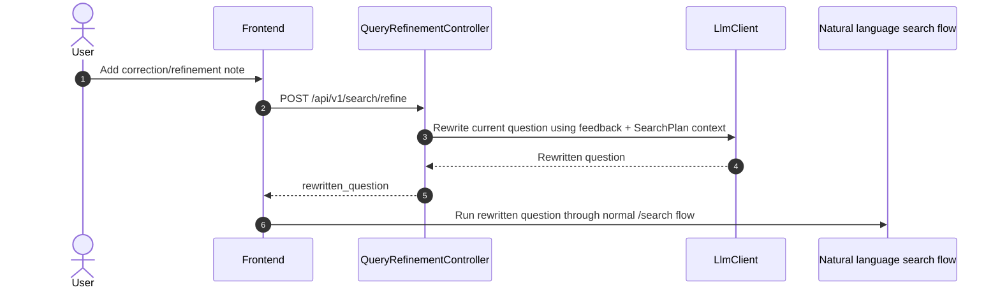

The refinement feature does not edit DSL directly. It produces a clearer natural language query and then reruns the normal guarded pipeline.

Audit display format:

```text
[AI Corrected] Original question: <original> | Feedback: <feedback>
```

## 6. AI Summary

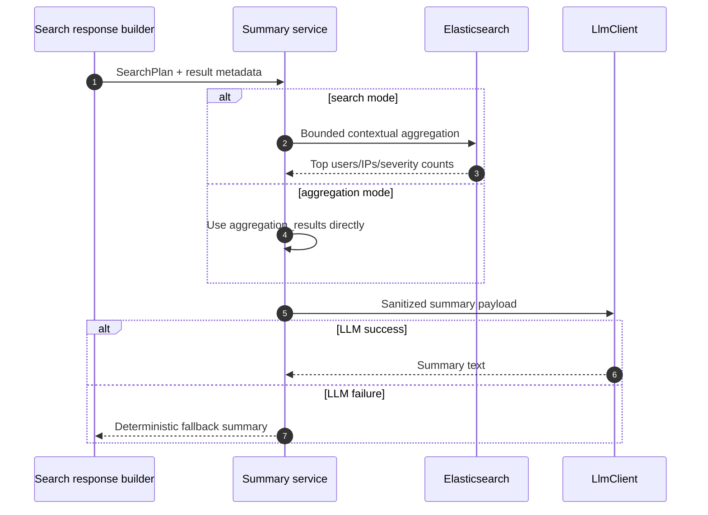

Raw forensic logs are not sent to the LLM.

## 7. AI Follow-up Suggestions

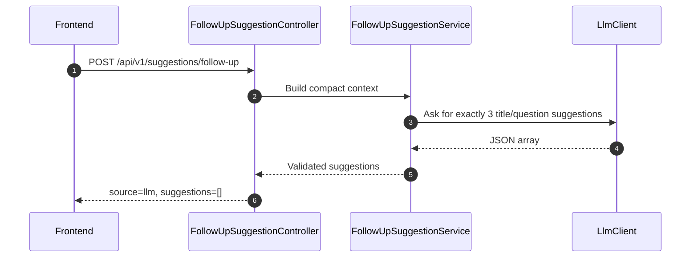

If the provider is mock or the configured live LLM provider fails, the UI hides this section. There is no static fallback for this feature.

## 8. Query Library

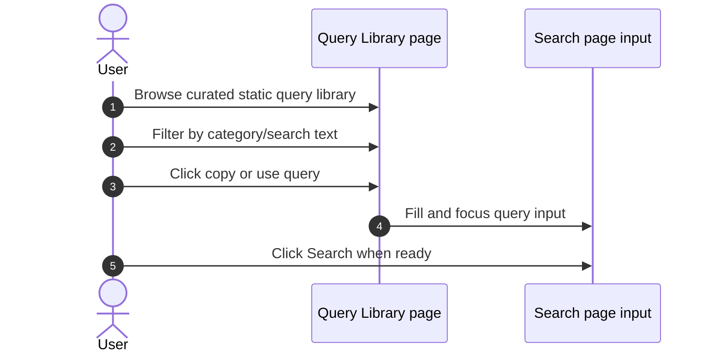

Query Library is static and deterministic. It does not call the LLM by itself.

## 9. History and Audit

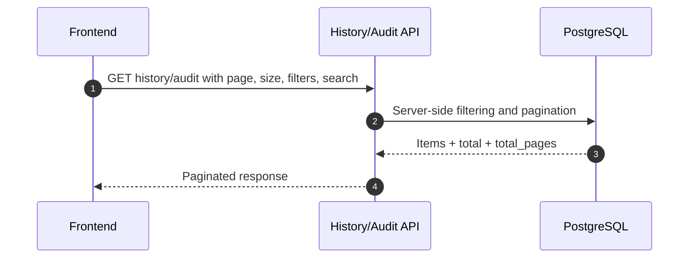

Supported UI filters include:

- status: success/failed
- mode: search/aggregation
- pinned, for investigations
- text search over query/history fields

Both Investigations and Audit use server-side pagination.

## 10. CSV Export

### Result CSV export

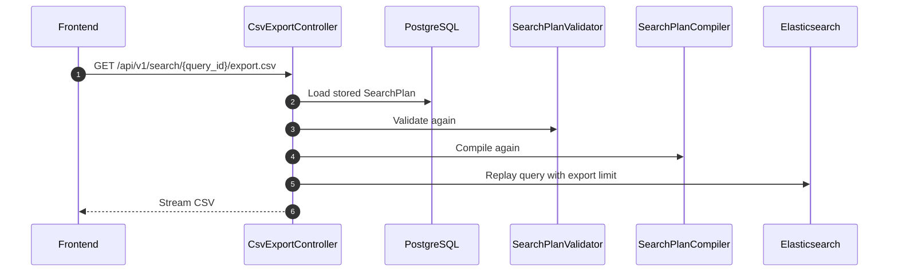

### Audit CSV export

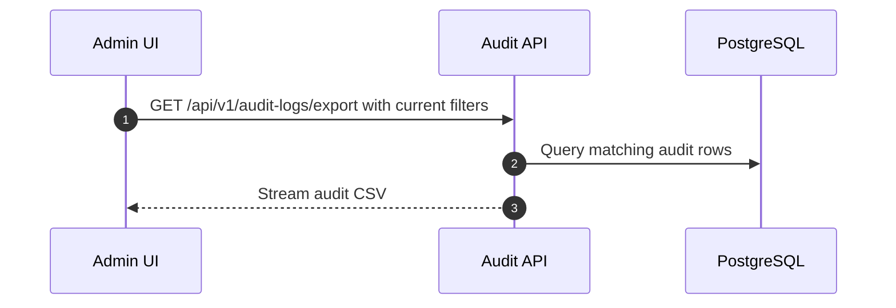

Export is not limited by the current UI page; it exports the filtered result set.

## 11. Event Detail

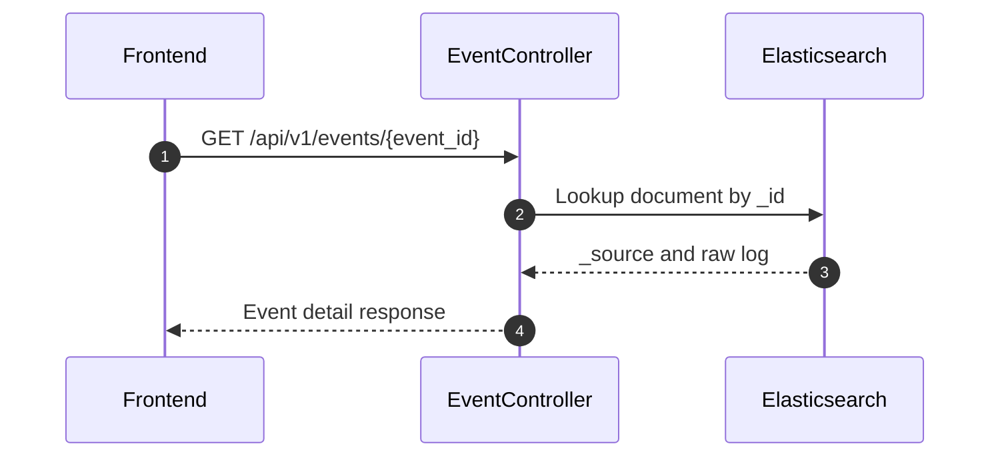

The event table is optimized for scanning; the centered event detail modal retrieves the full raw log on demand.
