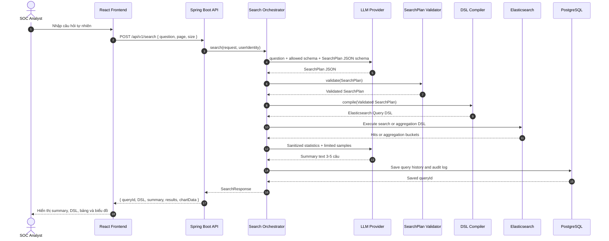
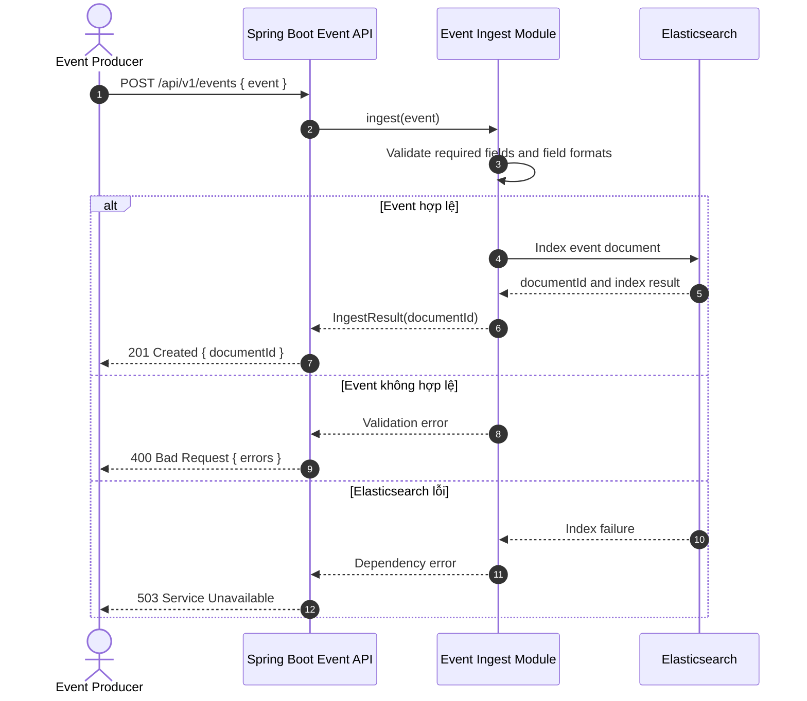
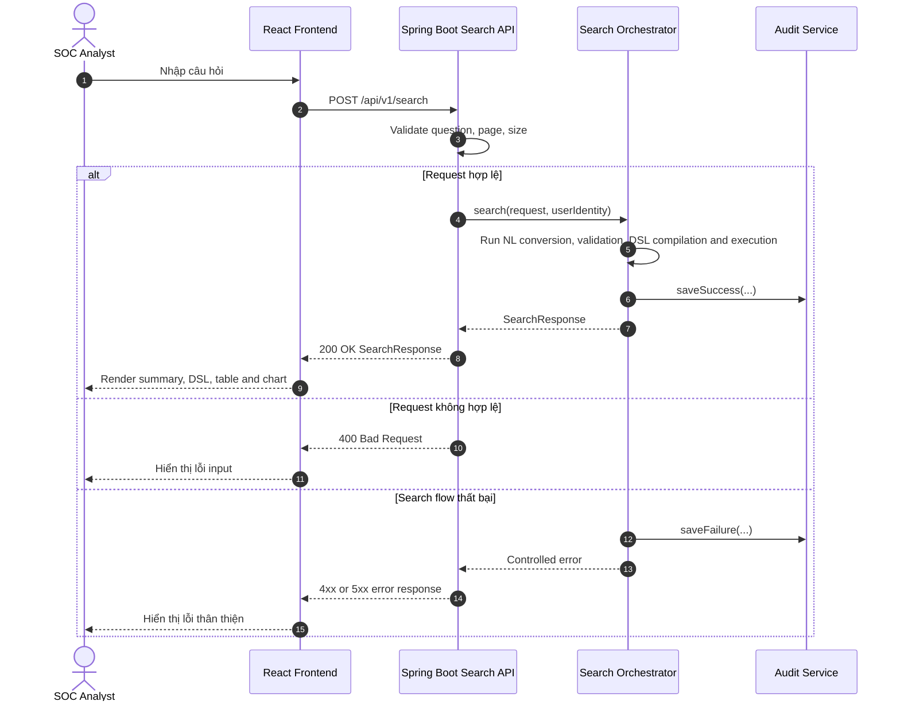
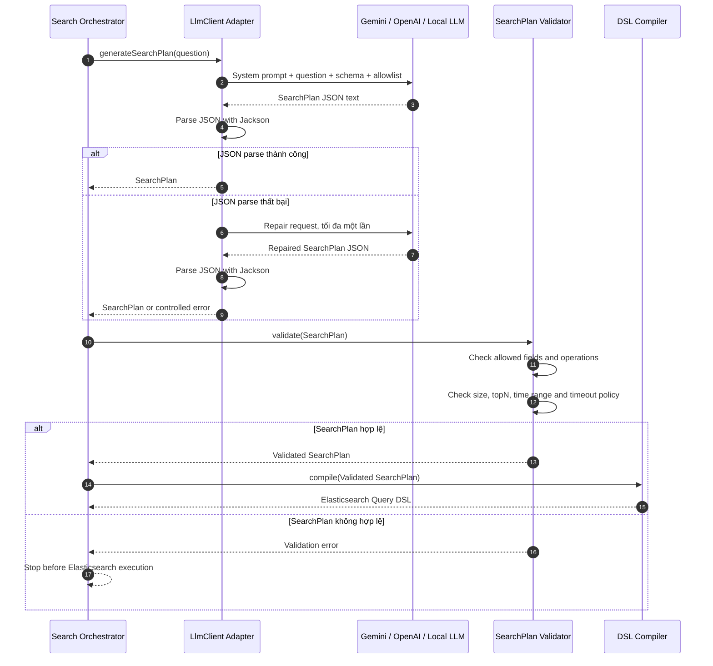
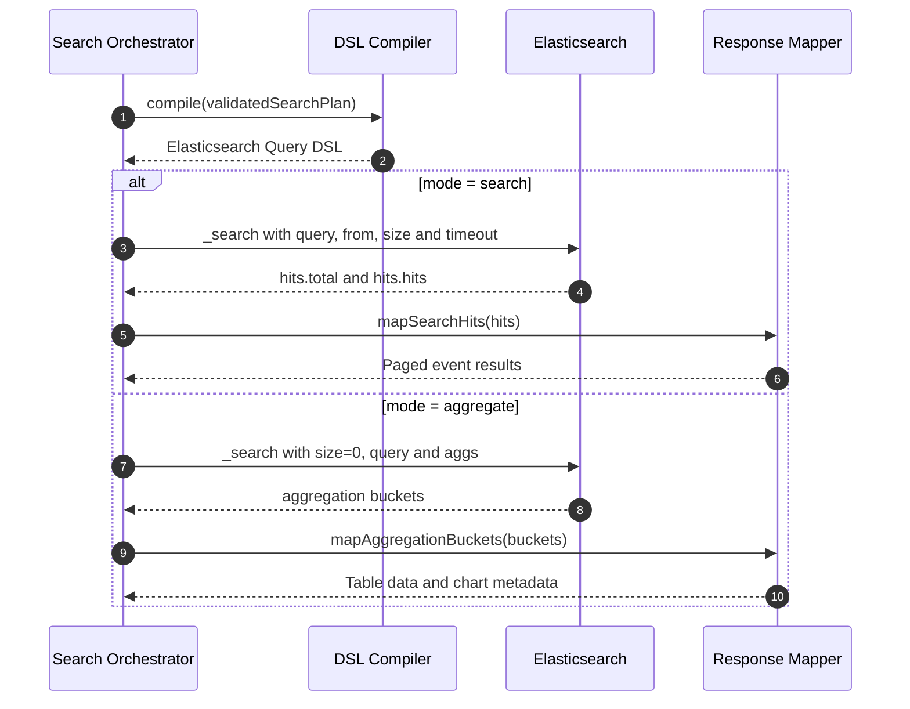
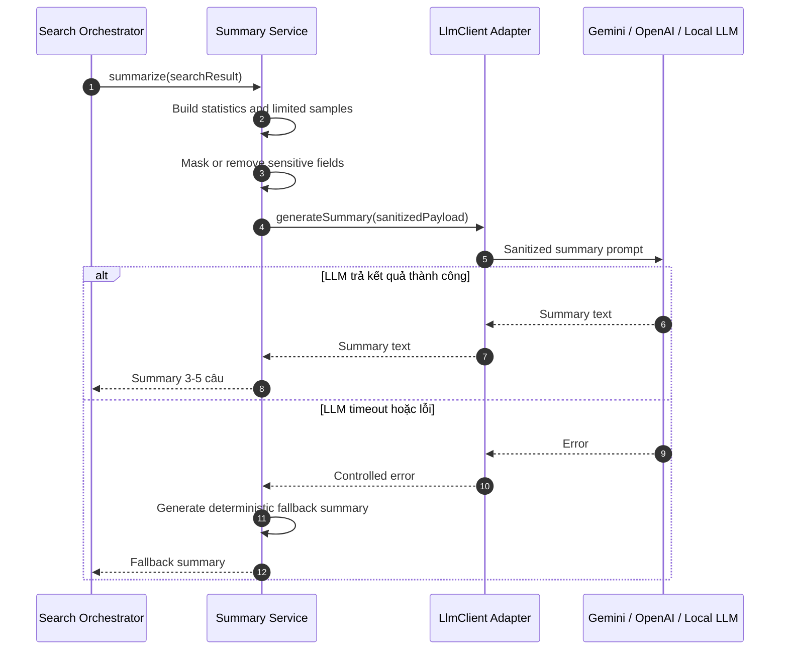
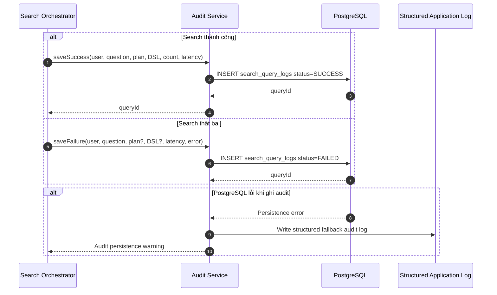
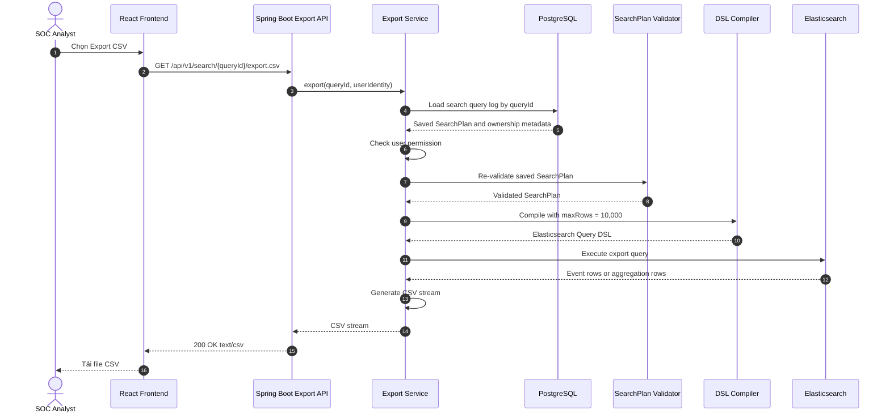
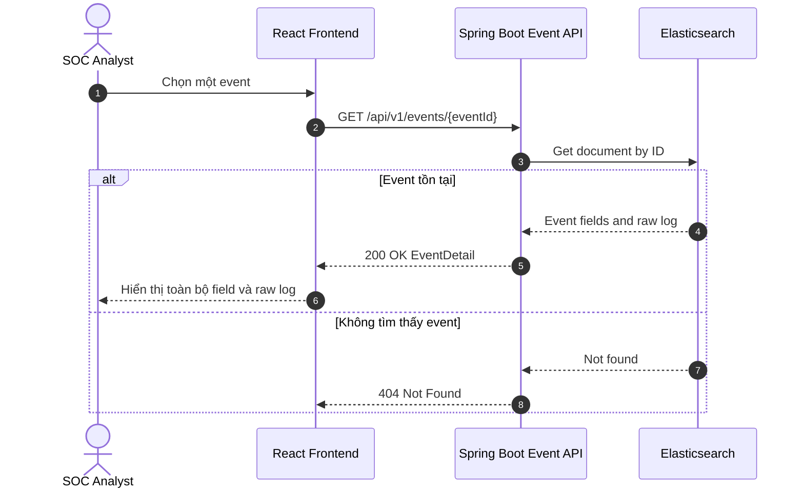

# Sequence Flows - SOC AI Event Search

## 1. Document Overview

### 1.1. Purpose

Tài liệu này mô tả trình tự xử lý dữ liệu cho đồ án:

> **Xây dựng tính năng Tìm kiếm Event bằng AI cho SOC Platform**

Các sequence diagram tập trung vào luồng MVP:

1. Ingest Event.
2. Natural Language Search.
3. NL -> Elasticsearch DSL.
4. Execute Search.
5. AI Summarization.
6. Save Audit Log.
7. Export CSV.

### 1.2. Architecture Boundary

Hệ thống dùng **Modular Monolithic Architecture**.

Trong các sơ đồ:

- `Spring Boot API`, `Search Orchestrator`, `SearchPlan Validator`, `DSL Compiler`, `Summary Service`, `Audit Service` và `Export Service` là module nội bộ của cùng một Spring Boot application.
- Các module nội bộ gọi nhau bằng Java method call.
- Chỉ Elasticsearch, PostgreSQL và LLM Provider được gọi qua network.

Kiến trúc tổng thể được mô tả tại [architecture.md](./architecture.md).

## 2. Components

| Component | Type | Responsibility |
| --- | --- | --- |
| User | Actor | SOC analyst hoặc event producer |
| React Frontend | Client | Nhận input, gọi REST API, render table, chart và CSV download |
| Spring Boot API | Monolith entry point | REST controller, request validation, response mapping |
| Search Orchestrator | Internal module | Điều phối search, summary, history và audit |
| `LlmClient` | Internal adapter | Gọi Gemini, OpenAI, Local LLM hoặc mock |
| SearchPlan Validator | Internal module | Áp dụng allowlist và giới hạn an toàn |
| DSL Compiler | Internal module | Compile `SearchPlan` thành Elasticsearch Query DSL |
| Summary Service | Internal module | Tạo payload đã mask và gọi LLM summarization |
| Audit Service | Internal module | Lưu history và audit log |
| Export Service | Internal module | Re-run query hợp lệ và stream CSV |
| Elasticsearch | Data store | Lưu event, search và aggregation |
| PostgreSQL | Data store | Lưu query history và audit log |
| LLM Provider | Dependency | Sinh `SearchPlan` và summary |

## 3. End-to-End Natural-Language Search

Đây là sequence chính dùng để trình bày luồng tổng thể.



### 3.1. Response Contract

Response search nên chứa:

```json
{
  "queryId": "uuid",
  "mode": "search",
  "originalQuestion": "Show me failed login attempts from China in the last 24h",
  "generatedDsl": {},
  "summary": "Phát hiện ...",
  "total": 42,
  "page": 0,
  "size": 20,
  "events": [],
  "aggregation": null,
  "chart": null
}
```

Với mode `aggregate`, `events` có thể rỗng và response chứa `aggregation` cùng `chart`.

## 4. Flow 1 - Ingest Event

### 4.1. Single Event Ingest

Endpoint:

```text
POST /api/v1/events
```



### 4.2. Event Payload

```json
{
  "timestamp": "2026-05-31T08:30:00Z",
  "source": "auth-service",
  "severity": "high",
  "event_type": "login_failed",
  "user": "demo-user",
  "host": "srv-auth-01",
  "ip": "203.0.113.10",
  "country_code": "CN",
  "message": "Failed login attempt",
  "raw": "..."
}
```

### 4.3. Bulk Ingest for Demo Dataset

Dataset local mặc định `10.000` event document và dataset vài triệu document dùng khi chuẩn bị bảo vệ hội đồng đều nên dùng:

```text
POST /api/v1/events/bulk
```

hoặc seed script nội bộ có tham số số lượng. Backend validate từng batch, chuyển thành bulk request và gọi Elasticsearch Bulk API. Không gửi từng event bằng hàng nghìn hoặc hàng triệu HTTP request riêng lẻ từ frontend.

## 5. Flow 2 - Natural Language Search

Endpoint:

```text
POST /api/v1/search
```

Request:

```json
{
  "question": "Đếm số lần login thất bại theo từng user trong 7 ngày qua",
  "page": 0,
  "size": 20
}
```



Input validation tại API:

- `question` không rỗng.
- `size <= 100`.
- `page >= 0`.
- User identity tồn tại nếu auth được bật.

## 6. Flow 3 - NL -> SearchPlan -> Elasticsearch DSL

LLM không được sinh Query DSL tùy ý để backend thực thi trực tiếp.

Luồng an toàn:

```text
Natural language
  -> LLM-generated SearchPlan JSON
  -> Backend validation
  -> Backend-owned DSL compiler
  -> Elasticsearch Query DSL
```

### 6.1. Sequence Diagram



### 6.2. Example SearchPlan

```json
{
  "mode": "aggregate",
  "filters": {
    "event_type": "login_failed",
    "timestamp": {
      "gte": "now-7d"
    }
  },
  "group_by": [
    {
      "field": "user",
      "size": 10
    }
  ],
  "metrics": [
    {
      "type": "count"
    }
  ]
}
```

### 6.3. Compiled Elasticsearch DSL

```json
{
  "size": 0,
  "query": {
    "bool": {
      "filter": [
        {
          "term": {
            "event_type": "login_failed"
          }
        },
        {
          "range": {
            "timestamp": {
              "gte": "now-7d"
            }
          }
        }
      ]
    }
  },
  "aggs": {
    "by_user": {
      "terms": {
        "field": "user",
        "size": 10
      }
    }
  }
}
```

### 6.4. Guardrails

| Guardrail | Rule |
| --- | --- |
| Field allowlist | Chỉ cho phép `timestamp`, `source`, `severity`, `event_type`, `user`, `host`, `ip`, `country_code`, `message` |
| Operation allowlist | `match`, `term`, `range`, `count`, `terms`, `date_histogram` |
| UI result size | Tối đa 100 event mỗi trang |
| Aggregation size | `top_n <= 50` |
| CSV export size | Tối đa 10.000 dòng |
| Expensive query | Không cho script query hoặc wildcard tùy ý |
| Timeout | Thiết lập timeout cho Elasticsearch request |

## 7. Flow 4 - Execute Search

Search executor phân loại mode nhưng luôn dùng Elasticsearch trong MVP.



### 7.1. Search Mode Output

- `total`.
- `page`.
- `size`.
- Danh sách event.
- Event ID để mở trang detail.

### 7.2. Aggregate Mode Output

- Aggregation buckets.
- Table rows.
- Chart type:
  - `line` cho time bucket.
  - `bar` cho top N.
  - `pie` hoặc `bar` cho severity distribution.

## 8. Flow 5 - AI Summarization

AI summarization chạy sau Elasticsearch execution. Summary không được làm hỏng kết quả search nếu LLM lỗi.



### 8.1. Cloud LLM Data Policy

Khi dùng Cloud LLM API:

- Không gửi raw log.
- Không gửi toàn bộ search result.
- Chỉ gửi statistics và số lượng sample nhỏ đã giới hạn.
- Mask IP, username và hostname nếu không cần giữ nguyên.
- Chỉ dùng event thật khi được đơn vị phụ trách bảo mật phê duyệt.

Khi không được phép gửi dữ liệu ra ngoài, chuyển `LlmClient` sang Local LLM API hoặc dùng fallback deterministic.

## 9. Flow 6 - Save Query History and Audit Log

Audit log phải được ghi cho cả truy vấn thành công và thất bại.



### 9.1. Audit Log Data

| Field | Description |
| --- | --- |
| `user_id` | Analyst thực hiện query |
| `created_at` | Thời điểm |
| `question` | Câu hỏi tự nhiên |
| `search_plan` | Plan đã parse hoặc null nếu lỗi sớm |
| `generated_dsl` | DSL đã compile hoặc null nếu chưa compile |
| `mode` | `search` hoặc `aggregate` |
| `result_count` | Số kết quả |
| `latency_ms` | Tổng latency |
| `status` | `SUCCESS` hoặc `FAILED` |
| `error_message` | Lỗi đã sanitize |

Structured application log là fallback khi PostgreSQL tạm thời lỗi. Với production thực tế, cần bổ sung cơ chế thu thập log tập trung và cảnh báo audit persistence failure.

## 10. Flow 7 - Export CSV

Endpoint:

```text
GET /api/v1/search/{queryId}/export.csv
```

Backend không nhận Query DSL tùy ý từ frontend. Backend lấy lại `SearchPlan` đã lưu, validate và compile lại trước khi export.



### 10.1. Export Controls

- Kiểm tra user có quyền truy cập query history.
- Re-validate `SearchPlan`.
- Compile DSL tại backend.
- Giới hạn tối đa 10.000 dòng.
- Thiết lập timeout.
- Escape CSV formula injection đối với cell bắt đầu bằng `=`, `+`, `-` hoặc `@`.

## 11. Event Detail Flow

Event detail là phần hỗ trợ luồng điều tra sau khi user xem danh sách search.

Endpoint:

```text
GET /api/v1/events/{eventId}
```



Raw log chỉ trả về UI cho user đã xác thực và không gửi sang Cloud LLM.

## 12. Failure Handling Summary

| Failure | System Behavior |
| --- | --- |
| LLM không trả JSON hợp lệ | Repair tối đa một lần; nếu vẫn lỗi thì dừng trước Elasticsearch |
| `SearchPlan` vi phạm guardrail | Trả controlled error; không compile hoặc execute |
| Elasticsearch timeout | Trả lỗi thân thiện; ghi audit status `FAILED` |
| Summary LLM lỗi | Dùng deterministic fallback summary; vẫn trả kết quả search |
| PostgreSQL audit insert lỗi | Ghi structured fallback log và cảnh báo |
| CSV vượt giới hạn | Chặn export hoặc truncate theo policy và thông báo rõ |
| Event ingest sai schema | Trả `400 Bad Request` với lỗi field |

## 13. Traceability to MVP Requirements

| MVP Requirement | Flow |
| --- | --- |
| REST API ingest | Flow 1 |
| Natural language tiếng Việt hoặc Anh | Flow 2 |
| NL -> Elasticsearch DSL | Flow 3 |
| Search, filter, pagination | Flow 4 |
| Aggregation và chart | Flow 4 |
| AI summary 3-5 câu | Flow 5 |
| Query history và audit log | Flow 6 |
| CSV export | Flow 7 |
| Event detail và raw log | Event Detail Flow |

## 14. References

- [System Architecture](./architecture.md)
- [Tech Stack](./tech-stack.md)
- [Elasticsearch Decision](./search-engine-decision.md)
- [MVP Requirement](./requirement.md)
