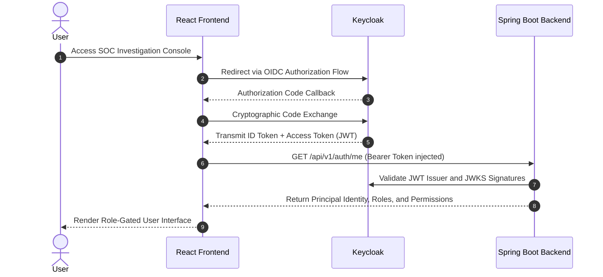
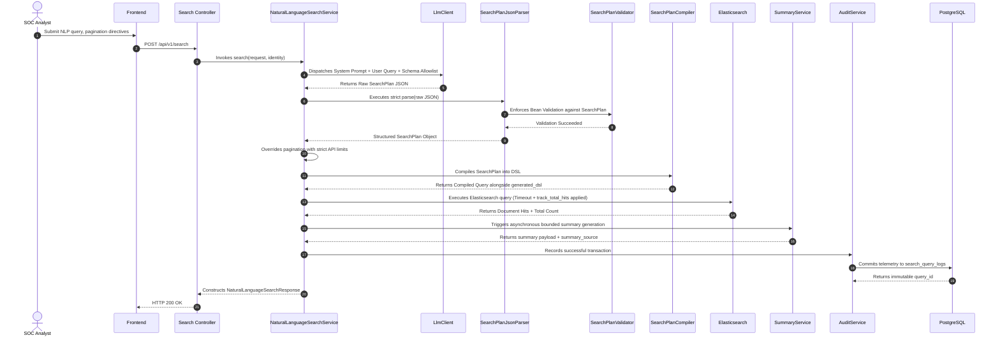
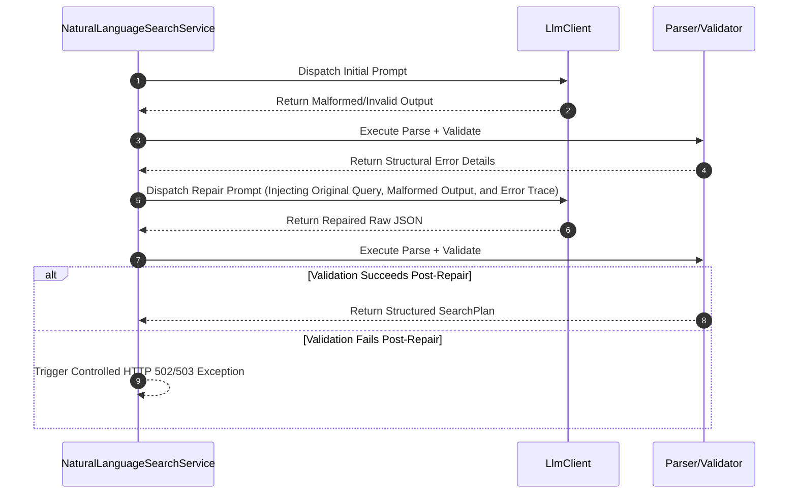
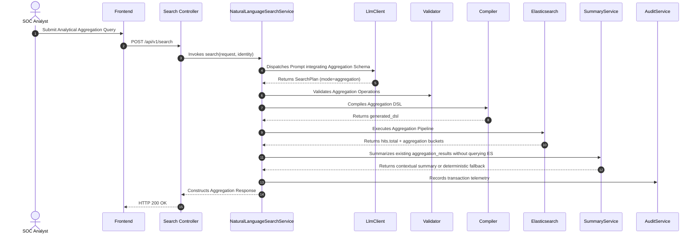
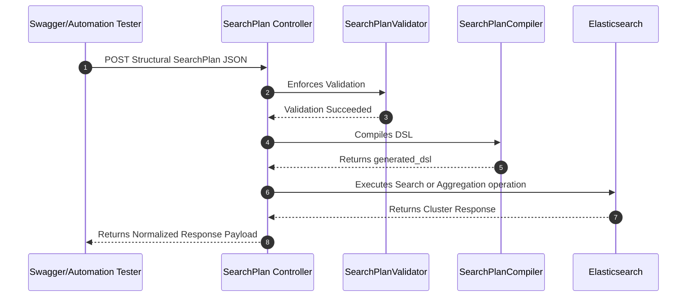
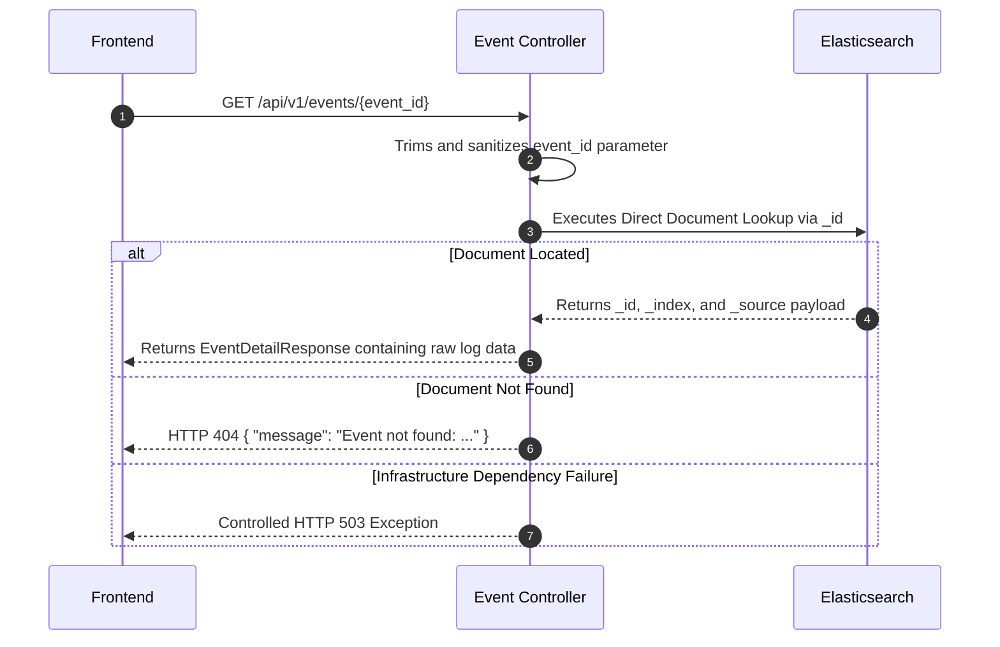
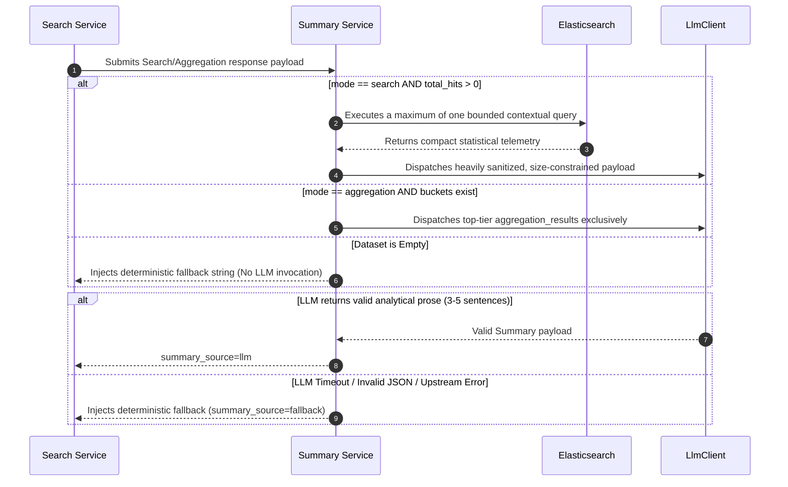
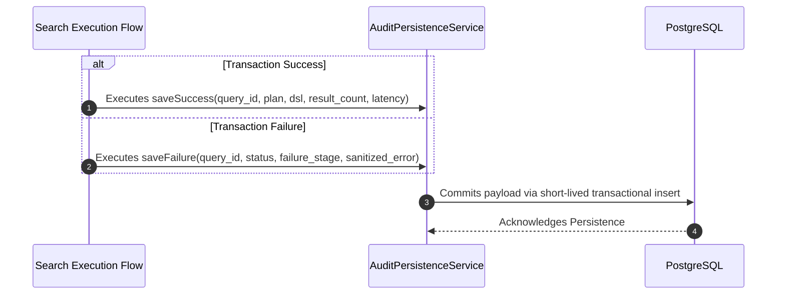
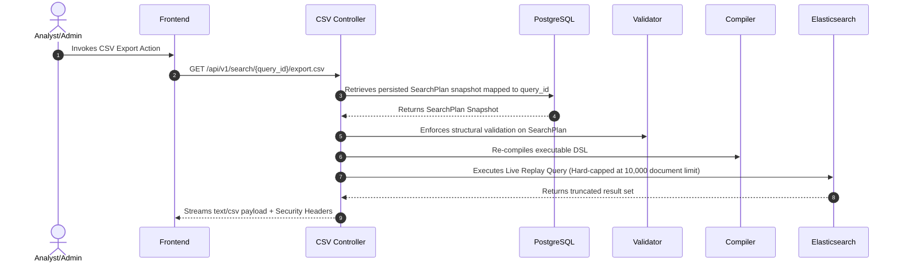

# 🌊 System Sequence Flows - SOC AI Search MVP

<details>
  <summary><b>📖 Table of Contents</b></summary>

  - [📝 1. Executive Summary](#1-executive-summary)
  - [🔐 2. Authentication and RBAC Pipeline](#2-authentication-and-rbac-pipeline)
  - [🔍 3. Natural Language Search Pipeline](#3-natural-language-search-pipeline)
  - [🛠️ 4. LLM Fault Tolerance: Repair-Once Flow](#4-llm-fault-tolerance-repair-once-flow)
  - [📊 5. Natural Language Aggregation Pipeline](#5-natural-language-aggregation-pipeline)
  - [⚙️ 6. Technical SearchPlan Execution Pipeline](#6-technical-searchplan-execution-pipeline)
  - [🔬 7. Forensic Event Drilldown Pipeline](#7-forensic-event-drilldown-pipeline)
  - [🤖 8. Best-Effort AI Summarization Logic](#8-best-effort-ai-summarization-logic)
  - [📜 9. Immutable Audit and Query Telemetry Pipeline](#9-immutable-audit-and-query-telemetry-pipeline)
  - [💾 10. Secure CSV Extraction Pipeline (Replay Mode)](#10-secure-csv-extraction-pipeline-replay-mode)
  - [🛡️ 11. Core Error Handling Philosophy](#11-core-error-handling-philosophy)
</details>

## 📝 1. Executive Summary

This document delineates the primary runtime execution flows comprising the SOC AI Search MVP:

1. 🔐 Identity Authentication and Role-Based Access Control (RBAC).
2. 🔍 Natural Language Search Execution.
3. 📊 Natural Language Analytical Aggregation.
4. ⚙️ Technical SearchPlan Execution.
5. 🔬 Forensic Event Detail Extraction.
6. 🤖 Best-Effort AI Summarization.
7. 📜 System Audit and Query History Logging.
8. 💾 Secure CSV Data Extraction (Replay Pipeline).

All API contracts rigidly adhere to a `snake_case` JSON standard (e.g., `query_id`, `original_question`, `generated_dsl`, `search_plan`, `aggregation_results`, `chart_metadata`).

## 🔐 2. Authentication and RBAC Pipeline

 



*Architectural Principle:* Backend authorization policies maintain absolute authority over the transaction lifecycle, irrespective of the UI elements rendered or disabled by the frontend.

## 🔍 3. Natural Language Search Pipeline

   



**Standardized Search Response Schema:**

```json
{
  "query_id": "uuid",
  "original_question": "Show me failed login attempts from China in the last 24h",
  "mode": "search",
  "search_plan": {},
  "generated_dsl": {},
  "summary": "...",
  "summary_source": "llm",
  "total": 123,
  "page": 0,
  "size": 20,
  "total_pages": 7,
  "llm_latency_ms": 50,
  "search_latency_ms": 30,
  "latency_ms": 100,
  "events": []
}
```

## 🛠️ 4. LLM Fault Tolerance: Repair-Once Flow



*Constraint:* The system strictly limits self-healing operations to a maximum of one attempt to prevent recursive loop degradation.

## 📊 5. Natural Language Aggregation Pipeline



**Standardized Aggregation Response Schema:**

```json
{
  "query_id": "uuid",
  "original_question": "Show the top 10 IP addresses with the most alerts this month",
  "mode": "aggregation",
  "search_plan": {},
  "generated_dsl": {},
  "summary": "...",
  "summary_source": "fallback",
  "total": 438,
  "aggregation_type": "top_n",
  "aggregation_results": [
    { "key": "10.0.0.5", "value": 124 }
  ],
  "chart_metadata": {
    "chart_type": "BAR",
    "x_axis_label": "ip",
    "y_axis_label": "count"
  },
  "events": []
}
```

## ⚙️ 6. Technical SearchPlan Execution Pipeline

**System Endpoint:**

```text
POST /api/v1/search/plan
```

This endpoint is structurally designed to validate the core SearchPlan architecture, bypassing the LLM integration entirely.



## 🔬 7. Forensic Event Drilldown Pipeline



## 🤖 8. Best-Effort AI Summarization Logic



## 📜 9. Immutable Audit and Query Telemetry Pipeline




**History Retrieval Endpoint:**

```text
GET /api/v1/search/history?page=0&size=20
```

**Administrative Audit Endpoint:**

```text
GET /api/v1/audit-logs?page=0&size=50
```

*Both endpoints yield standard paginated payloads containing: `items`, `page`, `size`, `total`, and `total_pages`.*

## 💾 10. Secure CSV Extraction Pipeline (Replay Mode)

 



**Browser-Exposed Security Headers:**

- 📑 `Content-Disposition` (Dictates safe file download handling).
- ⚠️ `X-Export-Truncated` (Signals to the UI whether the 10,000 document limit was breached).

## 🛡️ 11. Core Error Handling Philosophy

- ❌ **Malformed Client Requests:** HTTP 400 accompanied by a sanitized string explaining the breach.
- 🚫 **Unauthenticated Access:** HTTP 401.
- 👮 **RBAC Entitlement Violation:** HTTP 403.
- 🕳️ **Resource Resolution Failure:** HTTP 404.
- 🤖 **LLM Outage or Unrecoverable Repair:** Controlled HTTP 502/503.
- 📉 **Elasticsearch Outage:** Controlled HTTP 503.
- ⚠️ **Critical Security Mandate:** Raw stack traces, internal exception classes, or unhandled null pointers must **never** leak into external API payloads.